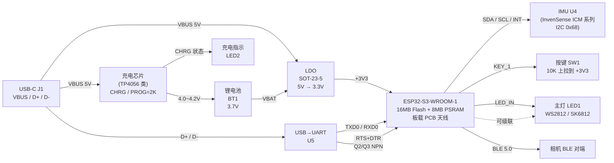

# CyberWand 硬件设计 v4.0

| 字段 | 值 |
|---|---|
| 创建时间 | 2026-04-05 |
| 最后更新 | 2026-05-02 |
| 当前版本 | **v4.0** (依据正式电路原理图 P1 修订) |
| 原理图 | `HardWare/schematic/` (创建 2026-04-19, 更新 2026-04-25) |
| PCB 几何 | `enclosure/DXF_PCB1_2026-05-01_AutoCAD2007.dxf` |
| 状态 | 已下单打样, 待焊接首板 |

---

## 0. v3.0 → v4.0 关键变更 (依据原理图 P1 实测, 4 张分块截图: 充电.png / IMU.png / MCU.png / USB.png)

### 0.1 主控与外设变更

| 项 | v3.0 (旧) | v4.0 (新, 与原理图一致) | 影响 |
|---|---|---|---|
| **MCU** | ESP32-C6-WROOM-1 (RISC-V 40MHz) | **ESP32-S3-WROOM-1-N16R8** (双核 Xtensa LX7 240MHz) | 全部 GPIO 编号 + Flash/PSRAM 规格 + 烧录方式都不同 |
| **Flash / PSRAM** | (未指定) | **16 MB QIO Flash + 8 MB Octal PSRAM** | `platformio.ini` 必须 `qio_opi` + 16MB 分区表才用满 |
| **PSRAM 占用 IO** | (未约束) | **IO26 ~ IO37 全部不可用** | board_config.h 中 `static_assert` 强制拦截 |
| **LED 类型** | 普通 0603 GPIO LED + 220Ω 限流 | **WS2812B 单线串行智能 LED** (4 Pin: VDD / GND / DIN / DOUT) | 软件必须用 RMT 驱动, `digitalWrite` 完全不工作 |
| **LED 上拉** | (无) | **R1 = 10 kΩ DIN 上拉到 +3V3** | 改善上电瞬间时序, 防误识第一帧 |
| **LED 级联接口** | (无) | **H1 = 3 Pin 跳线 (+3V3 / LED_OUT / GND)** | 后续可在杖头 / 杖中段加 WS2812 |
| **IMU 引脚命名** | MPU6050 简化封装 | 原理图 U4 含 **AUX_DA / AUX_CL / FSYNC / REGOUT / VLOGIC / CPOUT / RESV** | **InvenSense ICM 系列**特征 (ICM-20602/20689/20948 候选), 必须 BOM 确认 |
| **IMU CPOUT 电容** | (未明示) | **C7 = 2.2 nF 接 GND** | InvenSense 内部电荷泵专用, datasheet 强制要求, 不能省 |
| **IMU 地址** | 0x68 (假设) | **AD0 接 GND → 0x68** | 保持兼容 MPU-6050 库 |
| **IMU 旁路** | (未明示) | C8 = 0.01 μF + C9 = 0.1 μF 在 VLOGIC 旁; VDD pin 13 接 +3V3 | 标准做法, 必须焊全 |
| **USB 转串口** | (未明示) | **U5 (CH340 / CP210x 类)** + **Q2/Q3 NPN 自动复位** + R7/R8 = 10 kΩ 限流 | 不依赖 ESP32-S3 内置 USB-Serial-JTAG, 烧录稳定 |
| **充电 IC 位号** | (假设 U2) | **U3 (5 Pin: CHRG / GND / BAT / VCC / PROG)** | 文档命名修正 |
| **LDO 位号** | (假设 U3) | **LDO1 (SOT-23-5: VIN / VSS / CE / NC / VOUT)** | 文档命名修正 |
| **LDO 电容** | (假设 1μF) | **C3=0.1 μF + C4=0.01 μF (输入); C5=0.1 μF + C6=0.01 μF (输出)** | 容值修正 |
| **充电流** | (未明示) | **R5 = 2 kΩ → ~600 mA** (公式 I = 1200V/Rprog) + CHRG 状态回 MCU IO5 | 600mA 适合 300mAh 电池 (~2C, 略高, 见 §0.2 风险) |
| **电源切换** | (未明示) | **Q1 P-MOSFET + D1 肖特基** + **R4 = 100 kΩ / R6 = 100 kΩ Q1 栅极偏置** | USB 插入时关断电池路径, 拔 USB 时电池接通 |
| **VBAT ADC 采样** | (假设有) | **❌ 没有! R4/R6 是 Q1 栅极偏置, 不是 ADC 分压** | 当前固件不能读电量; 后续要读需重新加分压 + 找空闲 ADC IO |
| **电池接口** | (假设 BT1 焊接) | **H2 = 2 Pin 排针** (VBAT / GND) | 电池**外接**而非直接焊在 PCB 上, 要配 JST/PH 母线 |
| **主按键** | 普通触发 | SW1 + R2 = 10 kΩ 上拉到 +3V3, 接 MCU IO2 | 软件 `INPUT_PULLUP` 冗余上拉 |
| **主开关** | (未明示) | SW2 滑动开关串在 USB VBUS → LDO 路径 | 用户机械总开关 |

### 0.2 已识别的设计风险 (首板调试时**必须重点验证**)

| # | 风险 | 影响 | 验证方法 / 缓解 |
|---|---|---|---|
| **R1** | **I2C 总线没有外部上拉电阻** (IMU.png 上 SDA/SCL 直接走线, 无 4.7K) | 长走线 + 内部弱上拉 (~50K) 可能导致 I2C 通讯不稳, 高速下信号毛刺 | 首板用 I2C scanner 测 0x68; 信号差就在 SDA/SCL 各飞 4.7K 到 +3V3 |
| **R2** | **USB-C CC1 / CC2 引脚悬空** (充电.png 上 CC1 / CC2 / SBU1 / SBU2 都标 X = NC) | USB-C → USB-C 线**不会供电** (PC 端检测不到设备), 只能用 USB-A → USB-C 线 | 首板用 USB-A → USB-C 线供电烧录; 后续改板加 5.1K 双下拉 |
| **R3** | **LDO CE 引脚连接到 GND** (充电.png 上 LDO1 pin 3 CE → GND) | 大部分 LDO (ME6211 / SGM2036 / RT9080) 的 CE 是高电平有效, CE=GND 会让 LDO 输出 0V, 整板没电! | 上电前万用表测 LDO 实际输出; 若为 0V 则要么飞线把 CE 接 VIN, 要么换 CE 低有效的 LDO |
| **R4** | **充电电流 600 mA 对 300 mAh 电池偏高 (~2C)** | 长期充电会降低电池循环寿命, 严重时鼓包 | 改 R5 = 4.7 kΩ → 250 mA 更安全; 或选更大容量电池 (800~1000 mAh) |
| **R5** | **IMU pin 11 标 FSYNC 但接 INT 网络, pin 12 标 INT 但悬空** (IMU.png) | InvenSense 的 FSYNC 通常是输入 (帧同步), 不能反向输出中断; 可能是丝印误标或设计错误 | **软件已采用 "中断为主 + 轮询兜底" 策略** (`Mpu6050IMU::EnableDataReadyInterrupt`); 首板上电后无需手动判断, 看串口日志: 若打印 `[imu] DRDY interrupt timeout ... fallback to polling`, 说明 R5 真触发, 软件自动退到 7ms 轮询模式, 业务无感; 想恢复中断节能, 飞线把 IMU pin 12 (真 INT) 接到 IO4, 同时切断 pin 11 (FSYNC) 现有走线 |
| **R6** | **没有 VBAT 电量采样** | 软件读不到电池电压, 没法做"电量低告警 / 软关机" | 当前阶段暂不做电量管理; 后续改板加 R7'/R8' 100K + 找空闲 ADC IO (推荐 IO6 ~ IO15 任选) |

---

## 1. 系统架构

---

## 2. 硬件选型清单 (BOM, 与原理图位号一一对应)

### 2.1 主芯片

| 位号 | 元件 | 型号 / 规格 | 封装 | 数量 | 状态 |
|---|---|---|---|---|---|
| U1 | **主控** | **ESP32-S3-WROOM-1-N16R8** (16M Flash + 8M Octal PSRAM, 板载 PCB 天线, BLE 5.0) | 模组 | 1 | ✅ |
| U4 | **IMU** | InvenSense ICM 系列 (引脚 CLKIN / NC×4 / AUX_DA / AUX_CL / VLOGIC / AD0 / REGOUT / FSYNC / INT / VDD / NC×4 / RESV×2 / CPOUT / RESV / SCL / SDA, EP=GND, 候选: **ICM-20602 / ICM-20689 / ICM-20948**) | 24-pin QFN/LGA | 1 | ⚠️ 需 BOM 确认 |
| LDO1 | LDO | SOT-23-5 LDO 3.3V (1=VIN / 2=VSS / 3=CE / 4=NC / 5=VOUT, 常见 ME6211 / SGM2036 / RT9080) | SOT-23-5 | 1 | ⚠️ **CE 极性待确认 (R3)** |
| U3 | 充电 IC | TP4056 类 (1=CHRG / 2=GND / 3=BAT / 4=VCC / 5=PROG) | SOT-23-5 | 1 | ⚠️ |
| U5 | USB→UART | CH340N / CP210x 类 (含内部 V3 LDO) | SOP-16 | 1 | ⚠️ |

### 2.2 离散器件

| 位号 | 元件 | 规格 | 封装 | 用途 | 状态 |
|---|---|---|---|---|---|
| Q1 | P-MOSFET | SI2301 / AO3401 类 | SOT-23 | 电源切换 (USB 插入时关断电池路径, 拔 USB 时电池接通) | ⚠️ |
| Q2 | NPN 晶体管 | S8050 / MMBT3904 | SOT-23 | RTS 控制 IO0 (BOOT 模式) | ⚠️ |
| Q3 | NPN 晶体管 | S8050 / MMBT3904 | SOT-23 | DTR 控制 EN (硬件复位) | ⚠️ |
| D1 | 肖特基二极管 | SS14 / SD103 类 | SOD-323 | 电池路径反接保护 | ⚠️ |
| LED1 | **主指示灯** | **WS2812B** (4 Pin: VDD / GND / DIN / DOUT) | 5050 | 灯效输出, 必须 RMT 驱动 | ✅ |
| LED2 | 充电指示 | 红色 0603 LED | 0603 | 充电时 U3 CHRG 拉低点亮 | ✅ |
| SW1 | 主按键 | 6mm 4 脚轻触开关 | SMD | 用户输入 (KEY_1 → IO2) | ✅ |
| SW2 | 电源滑动开关 | 单刀单掷 5 Pin | THT | 串在 USB VBUS → LDO 路径上 | ✅ |
| USB1 | USB-C 接插件 | 16Pin 母座 | SMD | 5V 供电 + USB 数据 | ⚠️ **CC1/CC2 NC, 见 R2** |
| H1 | LED 级联跳线 | 3 Pin 排针 (1=+3V3 / 2=LED_OUT / 3=GND) | THT | 后续可外接 WS2812 串 | ✅ |
| H2 | **电池接口** | **2 Pin 排针 (1=VBAT / 2=GND)** | THT | 锂聚电池外接 (非直接焊接), 配 JST/PH 母线 | ⚠️ 装配前要先焊电池线 |

### 2.3 阻容明细 (与原理图标注严格一致)

| 位号 | 值 | 封装 | 用途 |
|---|---|---|---|
| **R1** | 10 kΩ | 0402 | LED1 DIN 上拉到 +3V3 (改善 WS2812 时序边沿) |
| **R2** | 10 kΩ | 0402 | KEY_1 上拉到 +3V3 (按键松开时为高) |
| R3 | 10 kΩ | 0402 | 充电指示 LED2 限流 (+5V → R3 → LED2 → CHRG) |
| **R4** | **100 kΩ** | 0402 | **Q1 P-MOSFET 栅极偏置 (+5V 路径)** — 不是 ADC 分压 |
| **R5** | **2 kΩ** | 0402 | **U3 PROG 脚, 设充电电流 ≈ 600 mA (对 300mAh 电池偏高 ~2C)** |
| **R6** | **100 kΩ** | 0402 | **Q1 P-MOSFET 栅极偏置 (VBAT 路径)** — 不是 ADC 分压 |
| R7 | 10 kΩ | 0402 | Q2 基极限流 (RTS → IO0) |
| R8 | 10 kΩ | 0402 | Q3 基极限流 (DTR → EN) |
| C1 | 0.1 μF | 0402 | ESP32-S3 模组 VDD3P3 主旁路 |
| C2 | 0.01 μF | 0402 | ESP32-S3 模组高频旁路 |
| **C3** | **0.1 μF** | 0402 | LDO 输入主电容 |
| C4 | 0.01 μF | 0402 | LDO 输入高频旁路 |
| **C5** | **0.1 μF** | 0402 | LDO 输出主电容 |
| C6 | 0.01 μF | 0402 | LDO 输出高频旁路 |
| **C7** | **2.2 nF** | 0402 | **IMU U4 pin 20 (CPOUT) 接 GND, InvenSense 内部电荷泵专用** |
| C8 | 0.01 μF | 0402 | IMU VLOGIC 旁路 (高频) |
| C9 | 0.1 μF | 0402 | IMU VLOGIC 旁路 (主) |
| C10 | 0.1 μF | 0402 | CH340 V3 (pin 4, 内部 LDO 输出) 滤波 |

> ⚠️ **CC1/CC2 没有 5.1K 下拉电阻 / I2C 没有 4.7K 上拉电阻** — 这两组关键器件原理图上都缺失, 见 §0.2 R1 / R2.

---

## 3. 引脚分配表 (与原理图 MCU.png 严格一致)

> ⚠️ **维护规则**: 表中 GPIO 编号必须与 `Software/include/board_config.h` 里的 `cw::board::kPinXxx` 常量一一对应. **改板子 → 改两处 (本表 + board_config.h)**. `board_config.h` 里的 `static_assert` 会拦截误填到 N16R8 PSRAM 占用的 IO26~IO37 范围.

### 3.1 主控引脚映射 (来源: MCU.png, 模组各引脚已逐一比对)

| 信号网络 | 模组 Pin | ESP32-S3 IO | 方向 | 连接对端 | 软件常量 | 备注 |
|---|---|---|---|---|---|---|
| **+3V3** | 2 + 各 VDD | — | PWR | LDO1 输出 | — | 模组所有电源脚共一个 3.3V 网络 |
| **GND** | 1 / 40 / 41 / EP | — | PWR | 系统地 | — | — |
| **EN (RESET)** | 3 | CHIP_PU | IN | Q3 NPN 集电极 (← CH340 DTR) | — | 硬件自动复位, 模组内部弱上拉 |
| **BOOT (IO0)** | 27 | IO0 | I/O | Q2 NPN 集电极 (← CH340 RTS) | — | strapping, 烧录时被 CH340 拉低进下载模式 |
| **TXD0** | 37 | IO43 | OUT | CH340 RXD (U5 pin 2 = U0RXD) | `Serial.begin(115200)` | 调试串口 |
| **RXD0** | 36 | IO44 | IN | CH340 TXD (U5 pin 3 = U0TXD) | `Serial.begin(115200)` | 调试串口 |
| **KEY_1** | 38 | **IO2** | IN | SW1 + R2=10K 上拉到 +3V3 | `cw::board::kPinKey1` | 按下拉低, 软件 `INPUT_PULLUP` 冗余 |
| **LED_IN** | 35 | **IO42** | OUT | LED1 (WS2812B) DIN, R1=10K 上拉 | `cw::board::kPinLed1Data` | **必须 NeoPixel/RMT 驱动** |
| **I2C SCL** | 14 | **IO20** | OUT | U4 IMU pin 23 SCL | `cw::board::kPinI2cScl` | ⚠️ 无外部上拉, 见 §0.2 R1 |
| **I2C SDA** | 24 | **IO47** | I/O | U4 IMU pin 24 SDA (从模组底部引出) | `cw::board::kPinI2cSda` | ⚠️ 无外部上拉 |
| **IMU INT** | 4 | **IO4** | IN | U4 IMU pin 11 (网络名 INT, 但丝印为 FSYNC) | `cw::board::kPinImuInt` | ✅ 软件已用作 DRDY 中断输入, R5 触发时自动回退轮询, 见 §0.2 R5 |
| **CHRG (充电状态)** | 5 | **IO5** | IN | U3 充电 IC pin 1 (开漏输出) | `cw::board::kPinChargeStat` | 充电时拉低; 软件用 `INPUT_PULLUP` |

### 3.2 模组其它引脚 (原理图标 X = NC, 全部空闲, 板上未引出走线)

模组左侧 (pin 6~13): IO6, IO7, IO15, IO16, IO17, IO18, IO8, IO19 — 全 NC
模组底部 (pin 15~26): IO3, IO46, IO9, IO10, IO11, IO12, IO13, IO14, IO21, **IO47 (= SDA)**, IO48, IO45 — 除 IO47 外 NC
模组右侧 (pin 28~34): IO35, IO36, IO37, IO38, IO39, IO40, IO41 — 全 NC (IO35~37 也在 PSRAM 占用范围)
模组右上 (pin 39): IO1 — NC

> 后续如需扩展 (例如加 VBAT 采样 / 第二颗按键 / DRDY 中断), 优先从 **IO6 / IO7 / IO15 / IO16 / IO17 / IO18 / IO8 / IO19** 这 8 个左侧空闲 IO 中选, 都是 ADC1 通道, 安全且没有 strapping 副作用.

### 3.3 ESP32-S3-WROOM-1-N16R8 必须避开的引脚

| 引脚范围 | 原因 | 是否可用作普通 GPIO |
|---|---|---|
| **IO26 ~ IO37** | **N16R8 用于内部 8MB Octal PSRAM (SPI 总线 + CS + 数据 + WP + HD)** | ❌ **绝对不能用**, 用了 PSRAM 立刻崩 |
| IO22 ~ IO25 | ESP32-S3 不存在这些 IO 编号 | ❌ 不存在 |
| IO0 | strapping (BOOT 选择), 上电瞬间不能被外部强拉低 | 慎用, 接 CH340 自动复位 OK |
| IO3 | strapping (JTAG 选择) | 慎用 |
| IO45 / IO46 | strapping (VDD_SPI 电压选择 / Log Print 控制) | 慎用 |
| IO19 / IO20 | 默认 USB-Serial-JTAG D- / D+ | 本设计用外部 CH340, IO20 已挪用为 SCL |
| IO43 / IO44 | 默认 UART0 TX / RX (本设计已占用) | 已占用 |

> ⚠️ **N16R8 关键约束**: R8 = 8MB Octal PSRAM 占用了 IO26~IO37 共 12 个引脚, 这些引脚连同 Flash 引脚一起绑定在 SPI bus 上. `Software/include/board_config.h` 中的 `static_assert` 会在编译期拦住任何引脚号落入这一段.

---

## 4. 电路设计要点 (按原理图分块图: 充电.png / USB.png / MCU.png / IMU.png)

### 4.1 电源及充电管理 (`enclosure/充电.png`)

| 子电路 | 元件 | 关键参数 |
|---|---|---|
| **USB 输入** | USB-C USB1 | VBUS pin 2 + 11; GND pin 1 + 12; SHELL pin 13 + 14; D+ pin 7; D- pin 6 (DP1/DN2 同名翻转兼容); **CC1 / CC2 / SBU1 / SBU2 全部 NC (没有 5.1K 下拉)** |
| **主电源开关** | SW2 滑动开关 (5 Pin) | 串在 USB VBUS (`+5V`) → LDO 输入 (`VCC`) 路径上, 用户机械总开关 |
| **LDO 稳压** | LDO1 (SOT-23-5) | 1=VIN / 2=VSS / 3=CE / 4=NC / 5=VOUT; **CE 直接接 GND ⚠️ 见 §0.2 R3**; 输入 C3=0.1 μF + C4=0.01 μF; 输出 C5=0.1 μF + C6=0.01 μF; VOUT = +3V3 |
| **充电芯片** | U3 (TP4056 类 SOT-23-5) | 1=CHRG (开漏) / 2=GND / 3=BAT (= VBAT) / 4=VCC (= +5V) / 5=PROG (= R5=2 kΩ → ~600 mA); 单芯片完成恒流恒压充电 |
| **充电指示** | LED2 红色 + R3 = 10 kΩ | +5V → R3 → LED2 → U3 pin1 CHRG; 充电时 CHRG 拉低 → LED2 亮 |
| **充电状态回 MCU** | CHRG → MCU IO5 | 软件 `pinMode(IO5, INPUT_PULLUP); digitalRead(IO5) == LOW` 表示充电中 |
| **电源切换** | Q1 P-MOSFET + D1 肖特基 + R4/R6 = 100 kΩ | Q1 源极=+5V, 漏极=VCC (LDO 输入); R4 (+5V→栅极), R6 (VBAT→栅极) 形成栅极偏置; USB 插入时 Vgs ≈ 0, Q1 关断电池路径; 拔 USB 时 Vgs 拉低导通; D1 防电池反接 |
| **电池接口** | H2 (2 Pin 排针) | 1=VBAT / 2=GND, 锂聚 3.7V 300 mAh 用 JST/PH 母线外接 (非直接焊接) |
| **VBAT ADC 采样** | ❌ 无 | R4 / R6 是 Q1 栅极偏置电路, **不是 ADC 分压**; 当前固件无电量监测能力, 见 §0.2 R6 |

### 4.2 USB 转串口 - 调试及烧录 (`enclosure/USB.png`)

| 子电路 | 元件 | 关键参数 |
|---|---|---|
| **USB-UART 桥** | U5 (CH340 / CP210x 类 SOP-16) | 1=GND / 2=TXD (= U0RXD → MCU IO44) / 3=RXD (= U0TXD ← MCU IO43) / 4=V3 / 5=D+ / 6=D- / 13=DTR# / 14=RTS# / 16=VCC=+3V3 |
| **V3 内部 LDO 滤波** | C10 = 0.1 μF | U5 pin 4 (内部 3.3V LDO 输出, 仅供 CH340 自身用) 去耦 |
| **自动复位 - BOOT** | Q2 NPN + R7 = 10 kΩ 基极限流 | U5 RTS# → R7 → Q2 基极; Q2 集电极 → MCU IO0; RTS=0 → Q2 截止, IO0 高; RTS=1 → Q2 导通, IO0 拉低 |
| **自动复位 - RESET** | Q3 NPN + R8 = 10 kΩ 基极限流 | U5 DTR# → R8 → Q3 基极; Q3 集电极 → MCU EN; DTR=0 → Q3 截止, EN 高; DTR=1 → Q3 导通, EN 拉低 → MCU 复位 |
| **效果** | — | `pio run -t upload` 自动序列: 推 IO0 = 0 + EN = 0 → 释放 EN → MCU 进 ROM bootloader → esptool 烧录 → 释放 IO0 → 复位运行 |

> 选用外部 CH340 而非 ESP32-S3 内置 USB-Serial-JTAG: 1) 不占用 IO19/IO20 给 USB; 2) 不同 USB 控制器兼容性更好; 3) `Serial.print` 默认走 UART0 无需额外配置.

### 4.3 MCU (`enclosure/MCU.png`)

| 项 | 参数 |
|---|---|
| **模组** | ESP32-S3-WROOM-1-N16R8 (U1) |
| **CPU** | 双核 Xtensa LX7 @ 240 MHz |
| **存储** | 16 MB QIO Flash + 8 MB Octal SPI PSRAM |
| **GPIO 占用** | 41 个引脚中, 8 个外接 (见 §3.1) + 12 个 PSRAM 占用 (IO26~IO37) + 余下空闲 |
| **VDD3P3 旁路** | C1 = 0.1 μF + C2 = 0.01 μF, 就近模组 VDD3P3 (pin 2) |
| **EN 复位** | 内部上拉 + Q3 NPN 自动复位电路 |
| **IO0 上拉** | R1 = 10 kΩ 到 +3V3 (与 Q2 NPN 自动复位电路并行) |
| **天线** | 板载 PCB IPEX 天线, 模组一侧 ≥ 5 mm 净空区 |
| **天线净空** | 已通过 `enclosure/elder_wand.scad` v5.1.3 在 Z=48~60 mm 段做无槽避让 |
| **LED 级联接口 H1** | 3 Pin 排针: 1=+3V3 / 2=LED_OUT / 3=GND, 与 LED1 DOUT 串联 |

### 4.4 IMU (`enclosure/IMU.png`)

| 引脚 / 元件 | 连接 / 值 | 说明 |
|---|---|---|
| pin 1 CLKIN | GND | 不使用外部时钟, 内部 RC |
| pin 2-5 NC × 4 | X | — |
| pin 6 AUX_DA | NC (X) | 不用辅助 I2C 接磁力计 |
| pin 7 AUX_CL | NC (X) | 同上 |
| pin 8 VLOGIC | +3V3, 旁路 C8=0.01 μF + C9=0.1 μF | 数字逻辑电源 |
| **pin 9 AD0** | **GND** | I2C 地址 = **0x68** |
| pin 10 REGOUT | NC (X) | 内部稳压器输出, 不需要外部加电容 |
| **pin 11 FSYNC** | **接 INT 网络 → MCU IO4** | ⚠️ 丝印是 FSYNC 但接到 INT, 见 §0.2 R5 |
| pin 12 INT | 悬空 | ⚠️ 标 INT 但未连接, 见 §0.2 R5 |
| **pin 13 VDD** | **+3V3** | 模拟电源, 注意没看到额外旁路电容 (依赖 VLOGIC 旁的 C8/C9) |
| pin 14-19 NC × 6 | X | — |
| **pin 20 CPOUT** | **C7 = 2.2 nF 接 GND** | **InvenSense 内部电荷泵专用, datasheet 强制要求, 不能省** |
| pin 21, 22 RESV | X | InvenSense 保留 |
| **pin 23 SCL** | → MCU IO20 | ⚠️ 没有外部 4.7K 上拉, 见 §0.2 R1 |
| **pin 24 SDA** | → MCU IO47 | 同上 |
| pin 25 EP (Exposed Pad) | GND | 焊盘必须接地散热 |

**实际 IC 型号待 BOM 确认** (引脚分配特征是 InvenSense ICM 系列, 但寄存器布局各型号不同):

| 型号 | 轴数 | 寄存器是否兼容 MPU-6050 库 | 灵敏度系数 (±4g 量程) |
|---|---|---|---|
| MPU-6050 | 6 | ✅ 完全兼容 | 8192 LSB/g |
| MPU-9250 | 9 (含 AK8963 磁) | ⚠️ WHOAMI 不同 (0x71 vs 0x68), 主寄存器兼容 | 8192 |
| ICM-20602 | 6 | ⚠️ 部分寄存器地址变了 | 8192 |
| ICM-20689 / 20690 | 6 | ⚠️ 部分变 | 8192 |
| ICM-20948 | 9 (含 AK09916 磁) | ❌ 完全重新设计 | 16384 (默认 ±2g) |

→ 焊好首板烧测试程序读 WHOAMI (寄存器 0x75): 0x68 = MPU-6050; 0x71 = MPU-9250; 0x12 = ICM-20602; 0x98 = ICM-20689; 0xEA = ICM-20948.

### 4.5 LED (`enclosure/MCU.png` 右上区域)

| 项 | 参数 |
|---|---|
| **LED1 主指示灯** | WS2812B, 4 Pin: 1=VDD (=+3V3) / 3=GND / 4=DIN (= LED_IN ← MCU IO42) / 2=DO (= LED_OUT → H1 pin 2) |
| 数据时序 | 800 kHz, 24-bit GRB; 0 码: 0.4 μs 高 + 0.85 μs 低; 1 码: 0.8 μs 高 + 0.45 μs 低; ±150 ns 容差 |
| **驱动方式** | **必须用 ESP32 RMT 外设** (Adafruit NeoPixel / FastLED / 直接 RMT API), 严禁 `digitalWrite + delay` |
| DIN 上拉 | **R1 = 10 kΩ 接 +3V3** (改善上电时序边沿, 防止 LED 误识第一帧) |
| VDD 旁路 | (依赖系统 +3V3 总线去耦, LED 旁未单独加 0.1 μF) |
| **LED 级联** | LED1 DOUT (pin 2) → H1 排针 pin 2, 后续接更多 WS2812 时焊到 H1 即可 |
| LED2 充电指示 | 红色 0603, +5V → R3 (10 kΩ) → LED2 → U3 pin 1 CHRG, 充电时拉低点亮 |

---

## 5. PCB 物理规格

| 项 | 规格 | 备注 |
|---|---|---|
| 板尺寸 | 详见 DXF (`enclosure/DXF_PCB1_2026-05-01_AutoCAD2007.dxf`) | enclosure/elder_wand.scad v5.1.3 已基于此 DXF 精确预留卡槽 |
| 层数 | 2 层 | 顶层信号 + 底层 GND 平面 |
| 板厚 | 1.6mm | 标准 FR-4 |
| 表面工艺 | HASL 沉锡 / ENIG (推荐 ENIG) | 模组 / IMU LGA 焊盘平整度要求 |
| 阻焊颜色 | 任意 | 黑色配合外壳胡桃木配色更协调 (但黑色阻焊 PCB 厂可能加价) |

### 5.1 关键布局规则

1. **IMU 摆位**: 远离 LDO / 充电 IC (减少电源噪声), VDD 旁就近 0.1uF, 模拟地与数字地单点连接
2. **WS2812 LED**: VDD 旁 0.1uF, DIN 走线短直, 远离 RF 天线
3. **USB 差分对**: D+ / D- 等长布线 90Ω 差分阻抗, 与其他线 3W 间距
4. **RF 天线净空**: 模组一侧 ≥ 5mm 内不走线不铺铜, 外壳已通过 v5.1.3 SCAD 避让
5. **电源路径**: VBUS → LDO → +3V3 走宽线 (≥ 20mil), 多打过孔
6. **I2C**: SDA / SCL 走线短, 不平行长距离, 上拉电阻就近 IMU
7. **充电 IC 散热**: 充电时 IC 会发热, 底面铺铜 + 多过孔散热

---

## 6. 设计检查清单

### 6.1 v4.0 文档修订完成

- [x] MCU: ESP32-C6 → ESP32-S3-WROOM-1-N16R8
- [x] LED: 普通 GPIO LED → WS2812B + R1=10K 上拉 + H1 级联跳线
- [x] IMU 引脚特征识别 + AD0 = GND → 0x68
- [x] 充电 / 电源切换 / USB-UART / 自动复位电路全部按原理图细化
- [x] 阻容明细补全 (R5 = 2K → 600mA; C7 = 2.2nF CPOUT; LDO 输入输出 0.1μF + 0.01μF; 等)
- [x] **位号修正**: 充电 IC = U3 (非 U2), LDO = LDO1 (非 U3), 电池 = H2 排针 (非 BT1)
- [x] **删除 VBAT ADC 分压采样的错误描述**: R4/R6 实际是 Q1 栅极偏置, 不是 ADC 分压
- [x] 6 项设计风险登记 (§0.2): I2C 无上拉 / USB-C CC 悬空 / LDO CE 接地 / 600mA 偏高 / IMU INT 丝印矛盾 / 无 VBAT 采样

### 6.2 软件适配 (全部已完成 ✅)

- [x] `platformio.ini` → `esp32-s3-devkitc-1` + `qio_opi` Octal PSRAM + 16MB 分区 + `Adafruit NeoPixel@^1.12.0`
- [x] `Software/include/board_config.h` 集中所有 GPIO 常量 + N16R8 PSRAM 静态断言 + 颜色语义常量
- [x] `lib/led/led.h + led.cpp` 完全重写为 NeoPixel 驱动 (RMT 时序), 保留 `LedMode` 语义 + 新增颜色感知 `SetMode` + `SetColor`
- [x] `lib/imu/mpu6050_imu.cpp` `Wire.begin(cw::board::kPinI2cSda, cw::board::kPinI2cScl)` 显式指定
- [x] `src/main.cpp` 全部硬编码 GPIO 替换为 `board_config.h` 常量, LED 反馈升级为颜色语义 (录制=红/切模式=蓝快闪/确认=绿)
- [x] 本地单元测试 **56/56 PASS** + `pio run` 编译固件 **SUCCESS** (RAM 18.8% / Flash 15.2% / firmware.bin 970KB) + `verify_firmware_clean.sh` **ALL CHECKS PASSED**
- [x] **引脚号最终回填** (依据 4 张分块原理图): KEY_1=IO2, LED_IN=IO42, SCL=IO20, SDA=IO47, IMU INT=IO4, CHRG=IO5

### 6.3 焊好首板后必做的硬件确认

按 `HardWare/PCB_BRING_UP_GUIDE.md` 阶段 1~4 顺序执行, 重点关注 §0.2 的 6 项风险:

- [ ] **§0.2 R3 (LDO CE 极性)**: 上电前万用表测 LDO1 pin 3 实际电平 + pin 5 输出; 输出 ≠ 3.3V 立刻断电检查
- [ ] **§0.2 R2 (USB-C CC)**: 准备 USB-A → USB-C 数据线, 不要用 USB-C → USB-C 线
- [ ] **§0.2 R1 (I2C 上拉)**: 静态测 SDA / SCL 电压, 应接近 +3V3; 远小于 3V 就要飞 4.7K 上拉
- [ ] **§0.2 R5 (IMU INT)**: 不用单独烧测试程序, 直接跑业务固件看串口; 若 5 秒内出现 `[imu] DRDY interrupt timeout ... fallback to polling` 即 R5 触发 (此时业务正常但 CPU 没节省)
- [ ] **§0.2 R4 (充电流偏高)**: 用电流表串入 USB 测充电电流 ~600mA; 若电池温度 > 45°C 把 R5 换成 4.7kΩ → 250mA
- [ ] U4 IMU 型号: 烧 I2C scanner 验证 0x68 + 烧 WHOAMI 测试程序读寄存器 0x75, 与 §4.4 表格对照

---

## 7. 硬件 ↔ 软件同步规则 (单一可信源)

- **唯一入口**: `Software/include/board_config.h` 是硬件参数在软件侧的唯一入口. 所有 `*.cpp` / `*.ino` **禁止**直接写引脚字面值.
- **改板子 = 改 board_config.h**: 收到新版 PCB 时, 用户只需:
  1. 万用表回测每条 IO 网络的实际 GPIO 编号
  2. 修改 `board_config.h` 里对应 `cw::board::kPinXxx` 常量
  3. 同步修改 §3.1 表里的 ESP32-S3 IO 列
  4. `pio run` 重编译, `static_assert` 会自动拦住误改到 PSRAM 占用的引脚 (IO22~IO37)
- **元件参数**: 阻容值 / 充电电流 / IMU 灵敏度系数等放在 §2.3 与 §4 各小节, 软件侧的 `IMU_ACC_TRANS_CONSTANT` 等常量是镜像, 改一处必须改另一处.
- **新加外设**: 走 "原理图 → 本文档 §3.1 加行 → board_config.h 加 `kPinXxx` → 业务代码用常量" 的顺序, 避免硬编码.

---

## 8. 相关文档索引

- 电路原理图: `HardWare/schematic/` (P1)
- PCB 几何 DXF: `enclosure/DXF_PCB1_2026-05-01_AutoCAD2007.dxf`
- PCB 首板调试指南: `HardWare/PCB_BRING_UP_GUIDE.md`
- 3D 外壳与 PCB 嵌入: `enclosure/elder_wand_design.md`
- 装配说明: `enclosure/PRINT_AND_ASSEMBLY.md`
- 软件硬件配置入口: `Software/include/board_config.h`
- 软件设计文档: `Software/README` 与 `Software/test/README.md`
