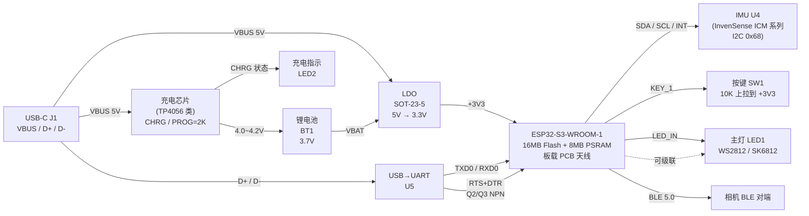

# CyberWand 硬件设计 v4.0

| 字段 | 值 |
|---|---|
| 创建时间 | 2026-04-05 |
| 最后更新 | 2026-05-02 |
| 当前版本 | **v4.0** (依据正式电路原理图 P1 修订) |
| 原理图 | `HardWare/schematic/` (创建 2026-04-19, 更新 2026-04-25) |
| PCB 几何 | `enclosure/DXF_PCB1_2026-05-01_AutoCAD2007.dxf` |
| 状态 | 已下单打样, 待焊接首板 |

---

## 0. v3.0 → v4.0 关键变更 (重要!!)

| 项 | v3.0 (旧) | v4.0 (新, 与原理图一致) | 影响 |
|---|---|---|---|
| **MCU** | ESP32-C6-WROOM-1 (RISC-V 40MHz) | **ESP32-S3-WROOM-1-N16R8** (双核 Xtensa LX7 240MHz) | 全部 GPIO 编号 + Flash/PSRAM 规格 + 烧录方式都不同 |
| **Flash / PSRAM** | (未指定) | **16 MB QIO Flash + 8 MB Octal PSRAM** | `platformio.ini` 必须 `qio_opi` + 16MB 分区表才用满 |
| **PSRAM 占用 IO** | (未约束) | **IO26 ~ IO37 全部不可用** | board_config.h 中 `static_assert` 强制拦截 |
| **LED 类型** | 普通 0603 GPIO LED + 220Ω 限流 | **WS2812B / SK6812 单线串行智能 LED** (DIN/DOUT) | 软件必须用 RMT 驱动, `digitalWrite` 完全不工作 |
| **LED 上拉** | (无) | **R1 = 10 kΩ DIN 上拉到 +3V3** | 改善上电瞬间时序, 防误识第一帧 |
| **LED 级联** | (无) | **H1 跳线 (+3V3 + LED_OUT)** 预留外接 | 后续可在杖头 / 杖中段加 WS2812 |
| **IMU 引脚命名** | MPU6050 简化封装 | 原理图 U4 含 **AUX_DA / AUX_CL / FSYNC / REGOUT / VLOGIC / CPOUT / RESV** | **InvenSense ICM 系列**特征 (ICM-20602/20689/20948 候选), 必须 BOM 确认 |
| **IMU CPOUT 电容** | (未明示) | **CF = 2.2 nF 接 GND** | InvenSense 内部电荷泵专用, datasheet 强制要求, 不能省 |
| **IMU 地址** | 0x68 (假设) | AD0 接 GND → **0x68** | 保持兼容 |
| **USB 转串口** | (未明示) | **U5 (CH340 / CP210x 类)** + **Q2/Q3 NPN 自动复位** | 不依赖 ESP32-S3 内置 USB-Serial-JTAG, 烧录稳定 |
| **USB-C CC** | (未明示) | **CC1 / CC2 各 5.1 kΩ 下拉** | USB 2.0 设备识别, 必须 |
| **LDO** | AP2112K-3.3 (SOT-223) | **SOT-23-5 5 脚 LDO** (VIN/VSS/EN/NC/VOUT), 输入 1μF+0.01μF, 输出 1μF+0.01μF | 封装更小, 容量需查 BOM |
| **充电管理** | (未明示) | **U2 (TP4056 类)** + **PROG = R5 = 2 kΩ → 600 mA 充电流** + CHRG 状态回 MCU IO11 | MCU 可读充电状态; 600mA 适合 300mAh 电池 (1C 充电安全) |
| **电源切换** | (未明示) | **Q1 P-MOSFET + D1 肖特基** 实现 USB / 电池自动切换 + 反接保护 | USB 插入时切到 VBUS, 拔掉自动切回电池 |
| **VBAT 采样** | (未明示) | **R4 = 100 kΩ + R6 = 100 kΩ 1:1 分压** | 软件可读电池电量, 实际电压 = ADC × 2 |
| **电池接口** | (未明示) | BT1, 锂聚 3.7V 300 mAh, 2 Pin (VBAT+/GND), 带保护板 | — |
| **主按键** | 普通触发 | SW1 + R2 = 10 kΩ 上拉到 +3V3 | 软件 `INPUT_PULLUP` 冗余上拉, 抗干扰 |
| **主开关** | (未明示) | SW2 滑动开关串在 USB VBUS 路径 | 用户机械总开关 |

---

## 1. 系统架构

---

## 2. 硬件选型清单 (BOM, 与原理图位号一一对应)

### 2.1 主芯片

| 编号 | 元件 | 型号 / 规格 | 封装 | 数量 | 嘉立创编号 | 状态 |
|---|---|---|---|---|---|---|
| U1 | **主控** | **ESP32-S3-WROOM-1-N16R8** (16M Flash + 8M Octal PSRAM, 板载 PCB 天线, BLE 5.0) | 模组 | 1 | 待填 | ✅ 确认 |
| U4 | **IMU** | InvenSense ICM 系列 (引脚 SCK/SDA/RES_V/CPOUT/AUX_DA/AUX_CL/VDD/FSYNC/INT/REGOUT/AD0/VLOGIC, 候选: **ICM-20602 / ICM-20689 / ICM-20948**) | LGA / QFN | 1 | 待填 | ⚠️ 需 BOM 确认实际型号 |
| U3 | LDO | SOT-23-5 LDO 3.3V (VIN / VSS / EN / NC / VOUT, 常见 ME6211 / SGM2036 / RT9080) | SOT-23-5 | 1 | 待填 | ⚠️ |
| U5 | USB→UART | SOP-8 USB-串口桥 (CH340N / CH343P / CP2102N) | SOP-8 | 1 | 待填 | ⚠️ |
| U2 | 充电 IC | TP4056 类锂电池充电管理 (CHRG 状态 + PROG 设流脚) | SOP-8 | 1 | C16581 (TP4056) / 待 BOM | ⚠️ |

### 2.2 离散器件

| 编号 | 元件 | 规格 | 封装 | 用途 | 状态 |
|---|---|---|---|---|---|
| Q1 | P-MOSFET | SI2301 / AO3401 类 | SOT-23 | 电源切换 (USB 插入时切到 VBUS, 否则切到 VBAT) | ⚠️ 待 BOM |
| Q2 | NPN 晶体管 | S8050 / MMBT3904 | SOT-23 | RTS 控制 EN (硬件复位) | ⚠️ |
| Q3 | NPN 晶体管 | S8050 / MMBT3904 | SOT-23 | DTR 控制 IO0 (BOOT 模式) | ⚠️ |
| D1 | 肖特基二极管 | SS14 / SD103 类 | SOD-323 | 电池路径反接保护 / 切换隔离 | ⚠️ |
| ED2 | LED | 红色 0603 (充电指示) | 0603 | 充电时 CHRG 拉低点亮 | ✅ |
| LED1 | **主指示灯** | **WS2812B / SK6812** (单线串行智能 LED, VDD / GND / DIN / DOUT) | 5050 / 2020 | 灯效输出, 必须 RMT 驱动 | ✅ |
| LED2 | (与 ED2 同, 看实际原理图位号) | — | — | — | — |
| SW1 | 主按键 | 6mm 4 脚轻触开关 | SMD | 用户输入, 一端接 GND, 另一端 KEY_1 | ✅ |
| SW2 | 电源滑动开关 | 单刀单掷 | THT | USB VBUS 路径主开关 | ✅ |
| J1 (USB1) | USB-C 接插件 | 16Pin 母座 (含 SBU1/SBU2 调试预留) | SMD | 5V 供电 + USB 数据 | ✅ |
| H1 | 跳线 / 排针 | 2 Pin (+3V3 + LED_OUT) | THT | **预留 LED 级联接口**, 可外接更多 WS2812 | ✅ |
| BT1 | 电池 | 锂聚合物 3.7V 300mAh (带保护板, 2 Pin VBAT+/GND) | 软包 | 主电源 | ✅ |

### 2.3 阻容明细

| 位号 | 值 | 封装 | 用途 |
|---|---|---|---|
| **R1** | 10 kΩ | 0402 | LED1 DIN 上拉 (改善 WS2812 时序边沿) |
| **R2** | 10 kΩ | 0402 | KEY_1 上拉到 +3V3 (按键松开时为高) |
| R3 | 10 kΩ | 0402 | 充电指示 LED (ED2) 限流 |
| R4 | 100 kΩ | 0402 | VBAT 分压采样上臂 (与 R6 配合 1:1 分压, ADC 读) |
| **R5** | **2 kΩ** | 0402 | **充电芯片 PROG 脚, 设充电电流 = 1200V/2kΩ ≈ 600 mA** |
| R6 | 100 kΩ | 0402 | VBAT 分压采样下臂 |
| R7 | 10 kΩ | 0402 | Q2 / Q3 基极限流 (自动复位电路) |
| C1, C2 | 0.1 μF / 0.01 μF | 0402 | ESP32-S3 模组 VDD3P3 旁路 (各 VDD 脚就近 1 颗) |
| C3 | 1 μF | 0402 | LDO 输入电容 |
| C4 | 0.01 μF | 0402 | LDO 输入高频旁路 |
| C5 | 1 μF | 0402 | LDO 输出电容 |
| C6 | 0.01 μF | 0402 | LDO 输出高频旁路 |
| C7 (= C8) | 0.1 μF | 0402 | IMU VDD 旁路 |
| C9 | 0.1 μF | 0402 | IMU VLOGIC 旁路 |
| **CF** | **2.2 nF** | 0402 | **IMU CPOUT 电荷泵旁路** (InvenSense IMU 内部电荷泵专用, datasheet 强制要求) |
| C10 | 0.1 μF | 0402 | CH340 V3 内部 LDO 输出滤波 |

---

## 3. 引脚分配表 (核心)

> ⚠️ **维护规则**: 表中 GPIO 编号必须与 `Software/include/board_config.h` 里的常量保持一致. **改板子 → 改两处 (本表 + board_config.h)**. board_config.h 里的 `static_assert` 会拦截误填到 N16R8 PSRAM 占用的 IO26~IO37 范围.

### 3.1 主控引脚映射

| 信号网络 | ESP32-S3 IO | 方向 | 连接对端 | 软件常量 (`board_config.h`) | 备注 |
|---|---|---|---|---|---|
| **+3V3** | VDD3P3 (各 VDD 脚) | PWR | LDO U3 输出 | — | 模组所有电源脚共 3.3V 网络 |
| **GND** | GND (各 GND 脚) | PWR | 系统地 | — | — |
| **EN (RESET)** | CHIP_PU | IN | CH340 RTS → Q3 NPN | — | 硬件自动复位, 上电默认高 (内部上拉 + 1uF 去抖) |
| **BOOT** | IO0 | IN | CH340 DTR → Q2 NPN | — | strapping pin, 烧录时拉低进下载模式 |
| **TXD0** | IO43 (UART0 默认 TX) | OUT | CH340 RXD | `Serial.begin(115200)` | 调试串口 |
| **RXD0** | IO44 (UART0 默认 RX) | IN | CH340 TXD | `Serial.begin(115200)` | 调试串口 |
| **KEY_1** | **IO4** | IN | SW1 一端 + R2=10K 上拉到 +3V3 | `kPinKey1` | 按下拉低, 软件 `INPUT_PULLUP` 冗余上拉 |
| **LED_IN** | **IO48** | OUT | LED1 WS2812B DIN | `kPinLed1Data` | **必须 RMT 驱动**; LED_OUT 经 H1 跳线可级联 |
| **I2C SDA** | **IO8** | I/O | U4 IMU SDA | `kPinI2cSda` | 4.7K~10K 就近上拉到 +3V3 |
| **I2C SCL** | **IO9** | OUT | U4 IMU SCL | `kPinI2cScl` | 同上 |
| **IMU INT** | **IO10** | IN | U4 IMU INT | `kPinImuInt` | DRDY 中断, 软件目前未启用 |
| **CHRG (充电状态)** | **IO11** | IN | 充电 IC CHRG 引脚 + ED2 限流 | `kPinChargeStat` | 充电时拉低, 充满 / 未插 USB 高阻; 软件 `INPUT_PULLUP` |
| **VBAT 采样** | (待定 ADC, 推荐 IO1~IO7) | AIN | R4/R6 100K 1:1 分压 | (待加) | 实际电压 = `analogRead` 读数 × 2; 当前固件未读取 |

### 3.2 ESP32-S3-WROOM-1-N16R8 必须避开的引脚

| 引脚范围 | 原因 | 是否可用作普通 GPIO |
|---|---|---|
| **IO26 ~ IO37** | **N16R8 用于内部 8MB Octal PSRAM (SPI 总线 + CS + 数据 + WP + HD)** | ❌ **绝对不能用**, 用了 PSRAM 立刻崩 |
| IO22 ~ IO25 | ESP32-S3 不存在这些 IO 编号 | ❌ 不存在 |
| IO0 | strapping (BOOT 选择), 上电瞬间不能被外部强拉低 | 慎用, 接 CH340 自动复位 OK |
| IO3 | strapping (JTAG 选择) | 慎用 |
| IO45 / IO46 | strapping (VDD_SPI 电压选择 / Log Print 控制) | 慎用 |
| IO19 / IO20 | 默认 USB-Serial-JTAG D- / D+ | 不用内置 USB 时可作普通 GPIO |
| IO43 / IO44 | 默认 UART0 TX / RX (本设计已占用) | 已占用 |

> ⚠️ **N16R8 关键约束**: R8 = 8MB Octal PSRAM 占用了 IO26~IO37 共 12 个引脚, 这些引脚连同 Flash 引脚一起绑定在 SPI bus 上, 软件代码访问会让 PSRAM 通信失败甚至崩溃. `Software/include/board_config.h` 中的 `static_assert` 会在编译期拦住任何引脚号落入这一段.

---

## 4. 电路设计要点 (按原理图区块, 与 P1.Schematic1 一一对应)

### 4.1 电源及充电管理 (原理图左上区域)

| 子电路 | 元件 | 关键参数 |
|---|---|---|
| **USB 输入** | USB-C J1 (USB1) | VBUS / D+ / D- / CC1 / CC2 / SBU1 / SBU2 / SHELL; CC1, CC2 各 5.1 kΩ 下拉 (USB 2.0 设备识别) |
| **主电源开关** | SW2 滑动开关 | 串在 USB VBUS → LDO 路径上, 用户机械总开关 |
| **LDO 稳压** | U3 (SOT-23-5) | VIN / VSS / EN / NC / VOUT; **EN 上拉到 VIN 常开**; 输入 C3 = 1 μF + C4 = 0.01 μF; 输出 C5 = 1 μF + C6 = 0.01 μF; VOUT = +3V3, 全系统数字电源 |
| **电源切换** | Q1 (P-MOSFET) + D1 (肖特基) | USB 插入时 Q1 关断电池路径, 拔 USB 时 Q1 导通让电池供电; D1 防电池反接 |
| **充电芯片** | U2 (TP4056 类) | VCC = USB VBUS, BAT = VBAT 输出, **PROG = R5 = 2 kΩ → 充电电流 ≈ 600 mA** (公式 I = 1200V/Rprog) |
| **充电指示** | ED2 红色 LED + R3 = 10 kΩ | CHRG 开漏输出: 充电拉低点亮, 充满高阻熄灭 |
| **充电状态回 MCU** | CHRG → IO11 | MCU 软件可读充电状态, 用 `INPUT_PULLUP` |
| **VBAT 采样** | R4 = 100 kΩ + R6 = 100 kΩ | 1:1 分压, 实际电压 = ADC 读数 × 2 |
| **电池接口** | BT1 (2 Pin) | 锂聚 3.7V 300 mAh 带保护板 |

### 4.2 USB 转串口 - 调试及烧录 (原理图左下区域)

| 子电路 | 元件 | 关键参数 |
|---|---|---|
| **USB-UART 桥** | U5 (CH340N / CP210x 类) | TXD / RXD 接 MCU UART0 (TXD0=IO43 / RXD0=IO44); D+ / D- 直连 USB-C |
| **V3 内部 LDO 滤波** | C10 = 0.1 μF | CH340 内置 3.3V LDO 输出脚去耦 |
| **自动复位 - RESET** | Q3 NPN + R7 = 10 kΩ 基极限流 | RTS 高 → Q3 截止 → EN 高; RTS 低 → Q3 导通 → EN 拉低 → MCU 复位 |
| **自动复位 - BOOT** | Q2 NPN + R7 = 10 kΩ | DTR 控制 IO0; esptool 时序: RTS 拉低 + DTR 拉低 → IO0 = 0, EN = 0 → 释放 EN → 进 ROM bootloader |
| **效果** | — | `pio run -t upload` 全自动烧录, 无需手动按 BOOT/RESET |

> 之所以用外部 CH340 而不是 ESP32-S3 内置的 USB-Serial-JTAG: 1) 烧录稳定性更好 (内置 USB 在某些 USB 控制器下兼容性差); 2) `Serial.print` 默认走 UART0 不需要额外配置; 3) 与 ESP32 经典款用户习惯一致.

### 4.3 MCU (原理图右上区域)

| 项 | 参数 |
|---|---|
| **模组** | ESP32-S3-WROOM-1-N16R8 |
| **CPU** | 双核 Xtensa LX7 @ 240 MHz |
| **存储** | 16 MB QIO Flash + 8 MB Octal SPI PSRAM |
| **GPIO** | 41 个, 但 IO26~IO37 被 PSRAM 占用 (见 §3.2) |
| **VDD3P3 旁路** | 各 VDD 脚就近 C1 = 0.1 μF + C2 = 0.01 μF |
| **EN 复位** | 内部上拉 + 1 μF 外部去抖电容 |
| **天线** | 板载 PCB IPEX 天线, 模组一侧 ≥ 5 mm 净空区 |
| **天线净空** | 已通过 `enclosure/elder_wand.scad` v5.1.3 在 Z=48~60 mm 段做无槽避让, 食指自然落位不在天线正上方 |

### 4.4 IMU (原理图右下区域)

| 引脚 / 元件 | 连接 / 值 | 说明 |
|---|---|---|
| VDD | +3V3, 旁路 C7 = 0.1 μF | 模拟电源 |
| VLOGIC | +3V3, 旁路 C9 = 0.1 μF | 数字逻辑电源 |
| **CPOUT** | **CF = 2.2 nF 接 GND** | **InvenSense 内部电荷泵专用, datasheet 强制要求, 不能省** |
| AD0 | 接 GND | I2C 地址 = 0x68 |
| SDA / SCL | → MCU IO8 / IO9 | I2C 总线, 就近 4.7K 上拉 |
| INT | → MCU IO10 | DRDY 中断输出 (软件可选用) |
| FSYNC, AUX_DA, AUX_CL, RES_V, REGOUT, CLKIN, NC | 多数 NC 或预留 | 软件不使用 |

**实际 IC 型号风险**: 引脚命名特征 (AUX_DA / AUX_CL / FSYNC / REGOUT / VLOGIC / CPOUT / RES_V) 是 InvenSense ICM 系列, **不一定**是 MPU-6050. 候选:

| 型号 | 轴数 | 寄存器是否兼容 MPU-6050 | 灵敏度系数 (±4g 量程) |
|---|---|---|---|
| MPU-6050 | 6 | ✅ 兼容 (本身就是 MPU-6050) | 8192 LSB/g |
| MPU-9250 | 9 (含 AK8963 磁) | 部分兼容 | 8192 |
| ICM-20602 | 6 | ⚠️ 部分寄存器地址变了 | 8192 |
| ICM-20689 / 20690 | 6 | ⚠️ 部分变 | 8192 |
| ICM-20948 | 9 (含 AK09916 磁) | ❌ 完全重新设计 | 8192 |

→ 焊好首板看 IC 丝印, 在硬件文档第 8 节 BOM 待填项里更新.

### 4.5 LED (原理图右上, MCU 旁)

| 项 | 参数 |
|---|---|
| **LED1 主指示灯** | WS2812B / SK6812, 4 Pin (+3V3 / GND / DIN / DOUT) |
| 数据时序 | 800 kHz, 24-bit GRB; 0 码: 0.4 μs 高 + 0.85 μs 低; 1 码: 0.8 μs 高 + 0.45 μs 低; ±150 ns 容差 |
| **驱动方式** | **必须用 ESP32 RMT 外设** (Adafruit NeoPixel / FastLED / 直接 RMT API), 严禁 `digitalWrite + delay` |
| DIN 上拉 | **R1 = 10 kΩ 接 +3V3** (改善上电时序边沿, 防止 LED 误识第一帧) |
| VDD 旁路 | 0.1 μF (与 MCU 共用电源去耦) |
| **H1 跳线** | **2 Pin: +3V3 + LED_OUT**, 预留外部级联接口, 后续可在魔杖中段 / 杖头加更多 WS2812 |
| ED2 充电指示 | 红色 0603, 由充电 IC CHRG 开漏输出驱动, 走 +3V3 → R3 (10kΩ) → ED2 → CHRG |

---

## 5. PCB 物理规格

| 项 | 规格 | 备注 |
|---|---|---|
| 板尺寸 | 详见 DXF (`enclosure/DXF_PCB1_2026-05-01_AutoCAD2007.dxf`) | enclosure/elder_wand.scad v5.1.3 已基于此 DXF 精确预留卡槽 |
| 层数 | 2 层 | 顶层信号 + 底层 GND 平面 |
| 板厚 | 1.6mm | 标准 FR-4 |
| 表面工艺 | HASL 沉锡 / ENIG (推荐 ENIG) | 模组 / IMU LGA 焊盘平整度要求 |
| 阻焊颜色 | 任意 | 黑色配合外壳胡桃木配色更协调 (但黑色阻焊 PCB 厂可能加价) |

### 5.1 关键布局规则

1. **IMU 摆位**: 远离 LDO / 充电 IC (减少电源噪声), VDD 旁就近 0.1uF, 模拟地与数字地单点连接
2. **WS2812 LED**: VDD 旁 0.1uF, DIN 走线短直, 远离 RF 天线
3. **USB 差分对**: D+ / D- 等长布线 90Ω 差分阻抗, 与其他线 3W 间距
4. **RF 天线净空**: 模组一侧 ≥ 5mm 内不走线不铺铜, 外壳已通过 v5.1.3 SCAD 避让
5. **电源路径**: VBUS → LDO → +3V3 走宽线 (≥ 20mil), 多打过孔
6. **I2C**: SDA / SCL 走线短, 不平行长距离, 上拉电阻就近 IMU
7. **充电 IC 散热**: 充电时 IC 会发热, 底面铺铜 + 多过孔散热

---

## 6. 设计检查清单

### 6.1 v4.0 修订完成

- [x] MCU 型号: ESP32-C6 → ESP32-S3-WROOM-1-N16R8 (16MB Flash + 8MB Octal PSRAM)
- [x] LED 类型: 普通 GPIO LED → WS2812B 智能 LED + LED_OUT 级联跳线 H1
- [x] IMU 引脚特征识别: 锁定 InvenSense ICM 系列, AD0 = GND → 0x68
- [x] 充电管理 / 电源切换 / USB-UART 自动复位电路一条龙补全
- [x] 引脚分配表填充 (`board_config.h` 与本表互为镜像)
- [x] N16R8 PSRAM 占用引脚 IO26~IO37 写入安全约束节
- [x] BOM 阻容明细补全 (R5 = 2K → 600 mA 充电流; CF = 2.2 nF CPOUT 强制电容; 等)

### 6.2 待用户照实物 / BOM 最终确认

- [ ] **R3.1 引脚分配表中的 IO 编号** (基于"原理图初判 + ESP32-S3 安全引脚"给出, 收到首板请用万用表针对每条 IO 网络回测一次, 不一致就改 `board_config.h` + 本文档同步)
- [ ] U4 IMU 实际型号 (看 IC 丝印或问 PCB 厂 BOM)
- [ ] U3 LDO 实际型号
- [ ] U5 USB→UART 桥实际型号 (CH340N / CH343P / CP2102N?)
- [ ] U2 充电芯片实际型号 (TP4056 / TP4057 / IP5306?)
- [ ] LED1 出货是单颗 WS2812B 还是已经级联多颗

### 6.3 软件适配进度 (详见 §7)

- [x] `platformio.ini` board → `esp32-s3-devkitc-1`, qio_opi PSRAM, 16MB 分区, NeoPixel 依赖
- [x] `Software/include/board_config.h` 集中所有 GPIO + 静态断言禁止用 IO22~IO37
- [ ] `lib/led/*` 重写为 NeoPixel WS2812 驱动 (保留 LedMode 语义)
- [ ] `lib/imu/mpu6050_imu.cpp` `Wire.begin(kPinI2cSda, kPinI2cScl)` 显式指定
- [ ] `src/main.cpp` 全部硬编码 GPIO 替换为 `board_config.h` 常量
- [ ] 本地单元测试 56/56 仍 PASS + `pio run` 编译固件 SUCCESS + `verify_firmware_clean.sh` 通过

---

## 7. 软件兼容性影响速查 (v3.0 → v4.0)

| 软件文件 | 改动方向 | 严重程度 | 状态 |
|---|---|---|---|
| `platformio.ini` | 切到 `esp32-s3-devkitc-1` + Octal PSRAM (`qio_opi`) + 16MB 分区 + 加 `Adafruit NeoPixel` | 🔴 必改 | ✅ 已改 |
| `Software/include/board_config.h` | 新增, 集中所有 GPIO + N16R8 静态断言 | 🔴 新增 | ✅ 已增 |
| `lib/led/led.h` `lib/led/led.cpp` | 从 PWM/`digitalWrite` 完全重写为 NeoPixel; `LedMode` 语义 (Off/On/Blink/Breathe) 保留, 增加 `SetColor` 接口; **`AddLed` 第三参 active_level 删除, 不再适用 WS2812** | 🔴 整模块重写 | ⏳ 待做 |
| `lib/imu/mpu6050_imu.cpp` | `Wire.begin()` → `Wire.begin(kPinI2cSda, kPinI2cScl)`; 如焊的 IC 不是 MPU-6050 兼容寄存器布局, 换 InvenSense ICM 库或自写驱动 | 🟡 高 | ⏳ 待做 |
| `lib/imu/mpu6050_imu.h` | `IMU_ACC_TRANS_CONSTANT` (8192 LSB/g @ ±4g) 看实际 IMU 重新校核 | 🟡 中 | ⏳ IMU 型号确认后做 |
| `src/main.cpp` | 所有硬编码 GPIO (按键/LED/I2C/INT/CHRG) 全部用 `board_config.h` 常量替代 | 🟡 高 | ⏳ 待做 |
| `scripts/verify_firmware_clean.sh` | build dir 路径从 `.pio/build/cyberwand` 不变 (board name 不影响 env name); 但 **N16R8 启用 PSRAM 后固件 .bin 大小会增加 ~30 kB**, 阈值要复核 | 🟢 低 | ⏳ 复核 |

### 7.1 硬件 ↔ 软件同步规则 (单一可信源)

- **唯一入口**: `Software/include/board_config.h` 是硬件参数在软件侧的唯一入口. 所有 `*.cpp` / `*.ino` **禁止**直接写引脚字面值.
- **改板子 = 改 board_config.h**: 收到新版 PCB 时, 用户只需:
  1. 万用表回测每条 IO 网络的实际 GPIO 编号
  2. 修改 `board_config.h` 里对应 `kPinXxx` 常量
  3. 同步修改 §3.1 表里的"ESP32-S3 IO"列
  4. `pio run` 重编译, `static_assert` 会自动拦住误改到 PSRAM 占用的引脚 (IO22~IO37)
- **元件参数**: 阻容值 / 充电电流 / IMU 灵敏度系数等放在硬件文档 §2.3 与 §4 各小节, 软件侧的 `IMU_ACC_TRANS_CONSTANT` 等常量是这些参数在软件侧的镜像, 改一处必须改另一处.
- **新加外设**: 例如增加压感传感器 / 第二颗 WS2812, 走 "原理图 → 本文档 §3.1 加行 → board_config.h 加 `kPinXxx` → 业务代码用常量" 的顺序, 避免硬编码.

---

## 8. 相关文档索引

- 电路原理图: `HardWare/schematic/` (P1)
- PCB 几何 DXF: `enclosure/DXF_PCB1_2026-05-01_AutoCAD2007.dxf`
- PCB 首板调试指南: `HardWare/PCB_BRING_UP_GUIDE.md`
- 3D 外壳与 PCB 嵌入: `enclosure/elder_wand_design.md`
- 装配说明: `enclosure/PRINT_AND_ASSEMBLY.md`
- 软件硬件配置入口: `Software/include/board_config.h`
- 软件设计文档: `Software/README` 与 `Software/test/README.md`
