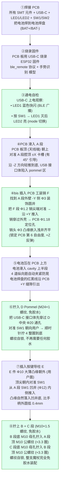
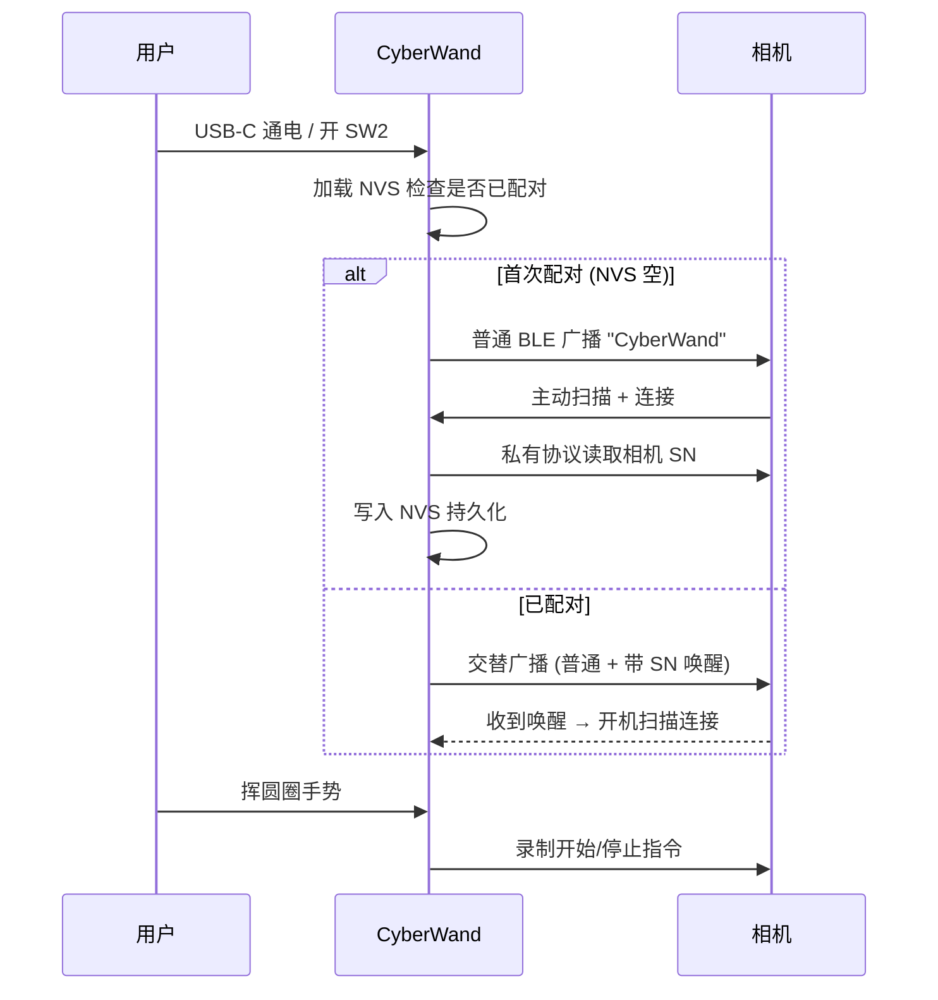

# CyberWand 3D 打印 & 装配指南

> **版本**: v5.1.7（全螺纹连接 + **PCB 工装销 100% 锁死 6 自由度**, 打印完直接装配)
> **配套源文件**: `elder_wand.scad`
> **STL 输出位置**: `stl/cyberwand_v51_*.stl`（**6 段**: D/A/B/C/E + **F PCB-Pin**）
>
> **v5.1.7 相对 v5.1.6 新增**（PCB 装入 6 自由度全锁死）:
> - **新增 F 段** `cyberwand_v51_F_pcb_pin.stl` — Φ1.2 × 19 mm PLA 工装销 + Φ3 装饰头
> - **新增** A handle 外壁 -Y 侧 Φ1.3 通孔 + Φ3.2 × 0.6 销头浅井（在 X=-11.58, Z=15.55）
> - **效果**: 利用 PCB 上现有的 Φ1.18 工厂定位孔, 锁死 PCB **第 6 自由度（+Z 反弹）**
>          → 之前仅靠 USB-C 接口卡耳 ~8 N 摩擦力锁定, 现在加销后 100% 机械锁死
>          → 销头嵌入外壳浅井齐平, 仅在 -Y 侧出现一个 Φ3 装饰圆点, 远离按键面美观无损
>
> **v5.1.6 重大变更**（D Pommel 与 A Handle 接缝）:
> - **删除** 旧的 D-A 嵌套榫 (Φ21 公凸 / Φ21.4 母凹) — 这本来还需要胶水才能锁紧
> - **新增** D-A 接缝 **M24×1 空心螺纹** (中央 Φ20 通孔让 USB-C 9×4 接口体穿过)
>          → 啮合 4 mm = **4 整圈**, 拧到底相位 0° (不会让 SW1 错位)
>          → 单边间隙 0.30 mm, FDM 0.4 mm 喷嘴可清晰打印
> - **修改** `pommel_dia_top` 22 → **24** (让顶径容纳 M24 螺纹 + Φ20 通孔, 凸柱壁厚 1.4 mm)
> - **效果**: 整支魔杖 **5 段 / 3 个接缝全部螺纹自锁**, 装配/拆卸/维修都不需要任何胶水
>          → A-B / B-C 早已是 M10×1.5 螺纹, 现在 D-A 也升级到螺纹
>
> **历史 v5.1.3 变更**（仅影响 A_handle 段几何）:
> - **删除** 4 个外凸椭圆按钮岛、8 道防滑纵向凹槽
> - **新增** SW1 凹井 Φ12 × 1.0 mm + SW2 圆角矩形滑槽 + LED 凹孔
> - **新增** 内部加厚岛 (cavity 内壁向 +Y 反凸 1.5 mm)
> - **效果**: 手柄外表面 100% 光滑圆锥面

---

## 一、6 段 STL 概览（v5.1.7 同源导出，全部 watertight，trimesh 实测）

| 段 | 文件 | 段高度 / 用途 | 顶点数 | 面数 | 体积 cm³ | PLA g | manifold |
|---|---|---|---:|---:|---:|---:|:---:|
| **D Pommel** | `cyberwand_v51_D_pommel.stl` | 12.00 mm（含 M24×1×4 空心螺纹凸柱 + USB 方孔贯穿） | 10,340 | 20,680 | 3.214 | 4.0 | ✓ |
| **A Handle** | `cyberwand_v51_A_handle.stl` | 109.00 mm（外壁平滑 + 凹井按键 + 内部加厚岛 + **PCB 销孔**） | 9,386 | 18,784 | 21.627 | 26.8 | ✓ |
| **B Decor**  | `cyberwand_v51_B_decor.stl`  | 61.00 mm（雕花结 + 鳞纹带 + 上铜环 ferrule） | 26,314 | 52,620 | 27.353 | 33.9 | ✓ |
| **C Shaft**  | `cyberwand_v51_C_shaft.stl`  | 200.00 mm（螺旋杖身 + 锥尖） | 16,242 | 32,480 | 15.417 | 19.1 | ✓ |
| **E Button** | `cyberwand_v51_E_button.stl` | 11.50 mm（按键导柱 Φ10 大薄凸缘 + Φ4.6 主柱） | 384 | 764 | 0.215 | 0.3 | ✓ |
| **F PCB-Pin** | `cyberwand_v51_F_pcb_pin.stl` | 19.43 mm（**PCB 工装锁定销** Φ1.2 主体 + Φ3 装饰头） | 200 | 396 | 0.023 | 0.03 | ✓ |
| **合计** | — | 368 mm 总长 | **62,866** | **125,724** | **67.848** | **~84.1** | — |

**v5.1.2 → v5.1.3 体积/重量变化**：
- A 段面数 5,558 → 2,522（减少 55%，去掉了 8 道防滑纹/SW1 双圆环/LED1 6 道扇形）
- 整体体积 67.93 → 67.10 cm³（减少 0.83 cm³，主要是 A 段减薄外凸特征）
- 整体重量 84 → 83 g PLA（**几乎不变**，强度等价）

**材料预算**（按 1.75 mm 耗材，密度 PLA 1.24 / PETG 1.27 / ABS 1.04 g/cm³）：

| 材料 | 整套重量 | 1 kg 耗材可打 |
|---|---:|---:|
| PLA  | 84 g  | ~12 套 |
| PETG | 86 g  | ~11 套 |
| ABS  | 71 g  | ~14 套 |

> 实际打印因填充率/支撑/废料会比净重多 15..30%，预留 ≥ 110 g 耗材较稳。

---

## 二、推荐切片参数（Cura / PrusaSlicer / OrcaSlicer 通用）

### 通用参数

| 参数 | A Handle | B Decor | C Shaft | D Pommel | E Button |
|---|---|---|---|---|---|
| **材料** | PLA / PETG | PLA / PETG | PLA / PETG | PLA / PETG | **TPU 95A** 或 PLA |
| **层高** | 0.16 mm | 0.12 mm | 0.16 mm | 0.12 mm | 0.10 mm |
| **壁厚** | 1.6 mm（4 层） | 1.2 mm（3 层） | 1.6 mm（4 层） | 2.0 mm（5 层） | 0.8 mm（2 层） |
| **填充** | 25% 三角 | 30% 三角（雕花结需要支撑） | 15% 三角 | 35% 立方（强度） | 100%（小件） |
| **顶/底层** | 4 层 / 4 层 | 4 层 / 4 层 | 4 层 / 4 层 | 5 层 / 5 层 | 4 层 / 4 层 |
| **打印速度** | 50 mm/s | 35 mm/s（雕花精度） | 50 mm/s | 40 mm/s | 25 mm/s |
| **支撑** | 仅腔顶端「Tree」 | **必须**「Tree」（cabochon 球凸悬） | **不需要** | 仅 pommel 顶面 | 不需要 |
| **黏附** | Brim 5mm | Brim 8mm（雕花重） | Raft（杖尖细） | Skirt 即可 | Brim 3mm |
| **预计耗时** | ~3.5 h | ~6 h | ~5 h | ~30 min | ~10 min |

### 关键工艺要点

1. **C 段 Shaft 杖尖朝上**：螺旋形天然向上收锥，零悬伸，**不需要任何支撑**
2. **B 段必须 Tree Support**：雕花结 24 颗 cabochon 球凸出 1.1 mm，普通 Linear Support 无法清理
3. **E 按键导柱用 TPU**：v5.1.3 凸缘 Φ10×0.6 大薄盘需要 0.1mm 层高才能精细，TPU 能让按压更柔软；如用 PLA 也可以但 dpi 要 ≥ 0.08mm
4. **A 段腔体竖向打印**：pommel 端朝下，cavity 顶端开口朝上，PCB 卡槽顶端 45° 引导斜面**自然朝上**便于装入
5. **A 段 v5.1.3 内部加厚岛**（新增）：
   - cavity 内壁在 z=5..60 区段向 +Y 反凸 1.5 mm（局部内径从 Φ31 → Φ28）
   - 凹井底壁厚 = 17 (外) - 1.0 (凹井) - 14 (内壁) = **2.0 mm**，安全
   - 内部加厚区位于 PCB 后方，**不挤压电池**（电池在 z=56..96 已错开）
   - 切片时 25% 三角填充会自动桥接加厚岛与外壳，**不需特殊设置**

---

## 三、各段最佳打印朝向

| 段 | 朝向 | 预览（实物配色） |
|---|---|---|
| A Handle | pommel 端朝下贴床 | `output/v513_print_orient_A.png` |
| B Decor  | 收颈底端朝下 | `output/v513_print_orient_B.png` |
| C Shaft  | 收颈底端朝下，杖尖朝上 | `output/v513_print_orient_C.png` |
| D Pommel | **顶面 (M24 空心螺纹凸柱) 朝上**（螺纹齿顺纹理打印, 不需要支撑；中央 Φ20 通孔 + 9×4 USB 方孔贯穿） | `output/v513_print_orient_D.png` |
| E Button | 凸缘 (Φ6) 朝下贴床 | `output/v513_print_orient_E.png` |
| **F PCB-Pin** | **销头 Φ3 朝下贴床, 销尖 Φ0.6 朝上**（无需支撑，竖直打印；建议同 A 段用 PLA） | — |

> 完整外观预览：`output/v513_outer_full.png`（竖直）/ `output/v513_horizontal.png`（水平）
> 装配近视：`output/v513_handle_close.png`（手柄段）/ `output/v513_pommel.png`（pommel 黄铜帽）
> 人体工学特征：`output/v513_ergo_features.png`（SW1 双圆环）/ `output/v513_ergo_full.png`（天线避让带）

---

## 四、装配工艺特征（v5.1.1）

### 1. pommel ↔ handle M24×1 空心螺纹（v5.1.6 改造，免胶水）

| 部件 | 结构 | 尺寸 |
|---|---|---|
| D Pommel 顶端公螺纹 | M24×1 × 高 4 mm 空心圆环（中央 Φ20 通孔让 USB 穿过） | 凸柱壁厚 1.4 mm |
| A Handle 底端母孔 | M24×1 × 深 4.2 mm 内螺纹 + 中央 Φ20 通孔 | 单边间隙 0.30 mm |
| 啮合圈数 | 4 mm ÷ 节距 1 mm = **4 整圈** | 拧到底相位 0° |

**装配方法**：把 PCB 板装入 A handle，USB-C 接口体先穿过 A handle 底部 Φ20 通道、再穿过 D pommel 中央方孔；让 SW1 凹井（A 段 +Y 面）朝向用户；A 段对准 D 螺纹，**顺时针拧 4 整圈到底**。螺纹自锁，**完全不需要任何胶水**。

> **拆卸**：反向旋出 4 圈即可取下 D pommel，方便事后维护 PCB / 更换电池。
>
> **为什么 4 整圈**：M24×1 节距 1 mm，啮合 4 mm = 4 圈整数。拧到底时 A 段相对 D 段旋转 1440°（= 4×360°），**起始与终止角度同相位**——只要装配时把 SW1 朝向用户对齐，拧到底后 SW1 仍然朝向用户，不会错位。
>
> **为什么 Φ20 通孔**：USB-C 接口在 PCB 上偏置（杖体坐标系下中心 X=−4.82），方孔 9×4 最远点离杖中心轴 9.53 mm > Φ10 通孔半径 5 mm，所以中央通孔必须 ≥ Φ20。这也是 pommel 顶径从 Φ22 放大到 Φ24 的原因（齿底 Φ22.8 + 通孔 Φ20 = 凸柱壁厚 1.4 mm，FDM 安全可打）。

### 2. PCB 卡槽 45° 引导斜面

卡槽顶端 1 mm 开口扩大 1 mm，形成 45° 楔形：
```
        ↓ PCB 滑入
    ╲  4×3.8 mm  ╱       ← 入口扩张到 4×3.8 mm
     ╲          ╱
      └─2×1.8─┘          ← 主卡槽 2×1.8 mm
        |   |
        | P |
        | C |
        | B |
        |   |
```
**好处**：PCB 不需要精准对位即可滑入，安装更轻松。

### 2 bis. PCB 装入 6 自由度限位（v5.1.7 完整方案）

| 自由度 | 限位机制 | 限位力/间隙 |
|---|---|---|
| ±Y (板厚晃动) | PCB 卡槽 1.8 mm 夹 1.6 mm 板厚 | 单边 0.10 mm 紧配 |
| ±X (沿板宽) | cavity Φ31 限位（角到圆心 14.05） | 单边 1.45 mm |
| −Z (向 pommel 滑) | `pcb_seat` 底托 + USB 接口体陷入方孔 | 1.0 mm 硬限位 |
| **+Z (反弹拔出)** | **PCB 工装销 Φ1.2 + USB 卡耳** | **机械锁死 + ~8 N 摩擦** |
| Rz (绕 Z 旋转) | 板边卡入 ±X 卡槽（28 mm 力臂） | 板边 14 mm 卡持 |
| Rx/Ry (倾倒) | 板厚卡持 + 板长 45 mm | 倾角 < 0.4° |

**关键说明**：
- PCB 板上**没有 M2+ 螺丝孔**，只有 2 个 Φ1.18 mm 工厂定位孔 → 不能用螺丝
- v5.1.7 增加 **PCB 工装销孔** 利用 PCB 现有定位孔 1（PCB 2.42, 35.35 → wand X=−11.58, Z=15.55）
- A handle 外壁 −Y 侧（电池仓侧, 远离按键面）打 Φ1.3 mm 通孔 + Φ3.2 mm 浅井
- 用户装好 PCB 后从外面插入独立打印的 **F 段 Φ1.2 PLA 销**，销穿过外壳→PCB Φ1.18 孔→停在 PCB +Y 上方
- 销头 Φ3 装饰圆点嵌入外壳浅井**齐平**（0.5 mm 凸缘 + 0.6 mm 浅井），外观仅看到一颗装饰圆点
- 维护拆装：用指甲撬住销头 Φ2.5 指甲槽即可拔出

```
A handle 外壁 -Y 侧:
    [外表面] ━━━━━━━━━ -16.985mm
        |Φ3.2 浅井|              ← 销头嵌入齐平
        | 0.6mm  |
        |Φ1.3   |                ← 通孔贯穿外壳
        | 通孔  |
    [cavity 内]                   
        | Φ1.2 销  |              ← PLA 销
        |  在此    |
        | 穿过    |              
    [PCB Φ1.18]   ←━━━━━━━━━ 0mm  ← PCB 板平面
        | 销末端  |
        | 在 +5  |              ← 销末端到达 PCB +Y 上方 5mm
    [-Y]  [+Y]
```

### 3. 按键导柱 O 圈坑（可选粘 Φ5 硅胶 O 圈）

凸缘背面凹一道环形坑（Φ5 内径 / Φ6 外径 / 深 0.3 mm）：
- **不装 O 圈**：导柱正常工作（间隙 0.4 mm 不漏灰尘但可能进水）
- **装 Φ5 硅胶 O 圈**：完全防尘、轻微密封、按压回弹更柔和

凸缘外端中心还有 Φ3 × 0.4 mm 浅圆坑——**用户手指自然找到按钮中心**。

---

## 四 bis、v5.1.3 平滑握持 + 凹陷式按键（仅影响 A 段）

设计目标：彻底重做 v5.1.2 的"外凸按钮+防滑纹"方案，让手柄外表面 100% 光滑，所有功能件改为凹陷在外表面**之内**，用户握持手感如同实木魔杖。

### 设计哲学转变

| 维度 | v5.1.2（旧） | **v5.1.3（新）** |
|---|---|---|
| 外表面 | 4 个椭圆凸台 + 8 道防滑纹 | **完全光滑圆锥面** |
| 按键 | 凸缘 Φ6 平齐凸台外表面 | **Φ12 凹井，凸缘 Φ10 沉入** |
| LED | Φ2.5 凹坑 + 6 道扇形 halo | **Φ4 圆形凹孔（光晕扩散↑60%）** |
| SW2 | 8mm 凸台 + 长方孔 | **4×12 圆角浅槽** |
| 强度方案 | 外凸 1.5mm 加厚 | **内凸 1.5mm 加厚（cavity 内壁反凸）** |
| 握持感 | "工业产品"，按钮硌手 | "魔杖/现代手柄"，无凸起 |

### 1. SW1 凹井（Φ12 × 深 1.0 mm 圆形井）

```
  俯视 SW1 凹井 (+Y 方向):
     ┌──────────────┐
     │              │  ← 手柄外表面 r=17, 完全平滑
     │    ╭────╮    │  ← 凹井 Φ12, 凹下 1.0 mm
     │    │ ╭▢╮│    │  ← 沉入凸缘 Φ10 × 0.6 mm
     │    │ ╰━╯│    │
     │    ╰────╯    │
     │              │
     └──────────────┘

  侧视图 (XY 平面, +Y 朝右):
     外壳 ─┐                   ┌─外壳
           │ 凹井 1.0 ↓        │
           │  ▣ 凸缘 0.6      │
           │       ↓ 0.4 行程  │
           │  ▣ 主柱 Φ4.6  ━━━│ 透通孔 Φ5
           │       ↓           │
           │  ▣ 顶尖 Φ4 → SW1 │
           │                   │
           │ 内部加厚岛 1.5 ━━│
```

**用户操作**：拇指自然伸入井 1mm 深，按下凸缘表面（Φ10 大盘易找），凸缘下沉 0.4 mm 触发 SW1。

**强度**：井底壁厚 = 17 - 1.0 - 14 = **2.0 mm**（内部加厚后内壁 r=14）。

### 2. SW2 拨杆滑槽（4 × 12 mm × 深 0.6 mm 圆角矩形）

```
  俯视 SW2 滑槽 (+Y 方向):
     ┌──────────────┐
     │              │
     │    ╭──╮      │  ← 圆角矩形浅槽 4×12 × 0.6
     │    │  │      │
     │    │↕ │      │  ← 拨杆从 4×10 内孔露出
     │    │  │      │     上下推动切换 ON/OFF
     │    ╰──╯      │
     │              │
     └──────────────┘
```

**用户操作**：拇指扫过手柄找到滑槽（凹下 0.6mm 触感明显），上下推动拨杆。

### 3. LED 凹光井（Φ4 × 深 0.8 mm，比 v5.1.2 大 60%）

```
  俯视 LED 凹光井 (+Y 方向):
     ┌───────────┐
     │           │
     │    ╭─╮    │  ← Φ4 凹孔 (浅圆坑)
     │    │ │    │
     │    │●│    │  ← 中心 Φ2 透光通道贯穿
     │    │ │    │     灌透明 UV 胶后 Φ4 范围扩散
     │    ╰─╯    │
     │           │
     └───────────┘
```

**优势 vs v5.1.2 扇形 halo**：
- 凹井本身就有"光晕扩散区"，不需要扇形结构
- 即使虎口部分覆盖 LED，凹井侧壁仍能透光
- 切片更简单（少 6 道扇形几何）

### 内部加厚岛（cavity 内壁反凸 1.5 mm，z=5..60）

为弥补凹井造成的局部减薄，在 cavity 内壁朝 +Y 方向反凸 1.5 mm，覆盖 SW1+SW2+LED1+LED2 全部 4 个功能件区域：

```
  XY 截面 (z=10, SW1 区):
     ╱─────────────╲
    ╱               ╲       ← 外壳 r=17 (光滑)
    │   ┌─────┐     │
    │   │     │     │       ← 内部加厚岛 (y=14..17, X=±16)
    │   │     │     │          连续覆盖所有按键区
    │   └─────┘     │
    │  PCB ━━━━━━━━━│       ← PCB 板表面 y=0.8 (距加厚岛 13.2mm)
    │   ┌─────┐     │
    │   │     │     │
    │   │     │     │
    │   └─────┘     │
    ╲               ╱
     ╲─────────────╱
```

**关键**：
- 加厚岛 z=5..60 完全错开电池区 z=56..96，**不挤压电池**
- 加厚岛 y=14..17 与 PCB 板表面 y=0.8 相距 13.2mm，**完全不影响 PCB 装入**
- 凹井+凹槽+凹孔的底壁厚度都 ≥ 2.0 mm，**比常规外壳 1.5mm 还强**

---

## 五、装配步骤（8 步流程）



⚠️ **关键提示**：

| 步骤 | 注意事项 |
|---|---|
| ③ | **必须**在拧上 D Pommel 前完成（不必怕，pommel 是螺纹连接，可拆） |
| ④ | PCB 必须从 A 段顶端开口装入（B 段已拧上则无法装 PCB） |
| ④bis | 销头**有 45° 倒角**自动对齐 PCB Φ1.18 孔，不要用蛮力。如果对不齐，请略微晃动 PCB 板让定位孔对准外壳通孔 |
| ⑥ | 全螺纹连接，不需要任何胶水。拧到阻力骤增 → 停手 |
| ⑦ | 不要硬塞导柱，确保对准 SW1 帽再轻推 |
| ⑧ | B/C 段第一次装配可能略紧，用力但不要拧到极限（M10 抗扭 2.7 N·m） |

---

## 六、装配爆炸图

> 完整爆炸图见 `output/v513_exploded.png`

```
                ▲ Z
                │
         ┌──────────────┐
         │   C Shaft    │  z = 168..368
         │ (螺旋杖身)    │
         └──────╤═══════┘
                │ M10×1.5 螺纹 (~3.3 圈, 免胶水)
         ┌──────┴───────┐
         │   B Decor    │  z = 112..168
         │ (雕花 + 铜环) │
         └──────╤═══════┘
                │ M10×1.5 螺纹 (~3.3 圈, 免胶水)
         ┌──────┴───────┐
         │   A Handle   │  z = 8..112
         │ ┌───────────┐│
         │ │ ▣ 电池    ││  z=55..95 (上)
         │ │ ▣ PCB     ││  z=6..51 (下)
         │ └───────────┘│
         │  ◉ E ←━━SW1  │  z=46  ← 按键导柱
         └──────╤═══════┘
                │ M24×1 空心螺纹 (4 整圈, 免胶水)
                │ ↳ 中央 Φ20 通孔让 USB-C 方孔穿过
         ┌──────┴───────┐
         │   D Pommel   │  z = 0..12  (主体 0..8, 螺纹凸柱 8..12)
         │  ▢ USB-C 方孔 │
         └──────────────┘
                │
                ▼ 充电口
```

---

## 七、维修与故障排查

| 故障现象 | 可能原因 | 解决方案 |
|---|---|---|
| BLE 不广播 | 电池没焊牢 / SW2 在 OFF 位 | 拨 SW2 / 充电后检查 |
| BLE 信号弱 / 偶丢包 | 食指压在天线区 (Z=50..56) | v5.1.3 手柄平滑无防滑纹，握姿自由；包装可贴防滑硅胶贴纸（避开 z=48..60） |
| SW1 按下无响应 | 导柱顶尖没对准 SW1 帽 | 拔出导柱重新对位（凹井内可见 Φ5 透通孔） |
| SW1 凸缘弹不出 | 凸缘 Φ10 太薄被卡 | 翻 0.6 mm 切片层高 → 0.08 mm，或在凸缘背面贴 0.2 mm 双面胶 |
| 盲操找不到 SW1 | 凹井太浅没触感 | v5.1.3 凹井已 1mm 深 + 井口 0.3mm 倒角；如仍不明显可贴 0.5mm 圆形贴纸 |
| LED 不亮 | 光导坑灌胶遮光 | 用透明 UV 胶, 不要用乳白 |
| LED 凹孔太亮太暗 | 灌胶量不当 | Φ4 凹孔灌胶应填到与外圆齐平（不溢出），UV 胶 ~10 mg |
| 充电不进 | USB 方孔装配偏移 | pommel 重新粘合时居中 |
| 按键卡住 | 凹井底有切片飞边 | 用 1mm 钻头清理凹井底 + Φ5 透通孔 |
| 雕花段切片失败 | manifold 检测 | v5.1.1 已修复，重出 STL |
| 内部加厚岛挤压电池 | 切片过填导致 | 检查 z=5..60 加厚岛 vs z=56..96 电池区，有 4mm 缓冲 |

---

## 八、固件烧录与首次配对

详见 `Software/README.md`。简要流程：



---

**文档版本**: v5.1.7
**最后更新**: 2026-05-07
**作者**: Snake / CyberWand Project
**版本变更摘要**：
- v5.1.0 → 引入 5 段拆分 + 嵌套榫
- v5.1.1 → 修 manifold + 加工艺特征
- v5.1.2 → 人体工学优化（天线避让带 / SW1 双圆环 / LED1 扩散光环）
- v5.1.3 → 平滑握持 + 凹陷式按键（仅 A 段几何变更）
- v5.1.4 → 上铜箍视觉延续（B 段 Φ19 鼓起金属环）
- v5.1.5 → A-B / B-C 接缝从 Φ8 圆柱榫升级到 **M10×1.5×5 螺纹**（免胶水）
- v5.1.6 → D-A 接缝从嵌套榫升级到 **M24×1×4 空心螺纹**（4 整圈, 整支魔杖 100% 免胶水装配）
- v5.1.7 → **新增 F 段 PCB 工装销** + A handle 外壁 -Y 销孔 + 销头浅井, 利用 PCB 现有 Φ1.18 工厂定位孔锁死 PCB 第 6 自由度（+Z 反弹）→ **PCB 6 自由度 100% 锁死, 不再依赖 USB 卡耳摩擦**
