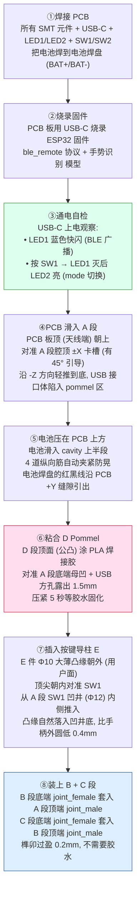

# CyberWand 3D 打印 & 装配指南

> **版本**: v5.1.3（平滑握持 + 凹陷式按键 + 内部加厚岛）
> **配套源文件**: `elder_wand.scad`
> **STL 输出位置**: `stl/cyberwand_v51_*.stl`（5 段）
>
> **v5.1.3 相对 v5.1.2 重大变更**（仅影响 A_handle 段几何）:
> - **删除** 4 个外凸椭圆按钮岛（SW1/SW2/LED1/LED2 不再凸出手柄外）
> - **删除** 8 道防滑纵向凹槽 + SW1 双圆环 + LED1 6 道扇形 halo
> - **新增** SW1 凹井 Φ12 × 1.0 mm（用户拇指自然按下凸缘）
> - **新增** SW2 圆角矩形滑槽 4×12 × 0.6 mm（拨杆操作面平滑）
> - **新增** LED Φ4 × 0.8 mm 圆形凹孔（光晕扩散范围 60% ↑）
> - **新增** 内部加厚岛（cavity 内壁向 +Y 反凸 1.5 mm，z=5..60 区段）
>          → 凹井底壁仍有 2.0 mm 实壁，强度不减
> - **修改** 按键导柱 E 件凸缘 Φ6×1.0 → **Φ10×0.6 大薄盘**（沉入凹井）
> - **效果**: 手柄外表面 100% 光滑圆锥面，握感无任何凸起硌手

---

## 一、5 段 STL 概览（v5.1.3 同源导出，全部 watertight，trimesh 实测）

| 段 | 文件 | STL 大小 | 段高度 | 顶点数 | 面数 | 体积 cm³ | PLA 重量 g | manifold |
|---|---|---:|---:|---:|---:|---:|---:|:---:|
| **D Pommel** | `cyberwand_v51_D_pommel.stl` | 255 KB | 9 mm（含嵌套榫公凸 1mm） | 752 | 1,504 | 2.76 | 3.4 | ✓ |
| **A Handle** | `cyberwand_v51_A_handle.stl` | **446 KB** | 104 mm（**外壁 100% 平滑** + 凹井按键 + 内部加厚岛） | **1,257** | **2,522** | 21.69 | 26.9 | ✓ |
| **B Decor**  | `cyberwand_v51_B_decor.stl`  | 3.6 MB | 56 mm（雕花结 + 鳞纹带 + 上铜环 ferrule） | 9,854 | 19,700 | 27.10 | 33.6 | ✓ |
| **C Shaft**  | `cyberwand_v51_C_shaft.stl`  | 3.0 MB | 200 mm（螺旋杖身 + 锥尖） | 8,054 | 16,104 | 15.34 | 19.0 | ✓ |
| **E Button** | `cyberwand_v51_E_button.stl` | 128 KB | 11.5 mm（**Φ10 × 0.6 大薄凸缘** + Φ4.6 × 9.9 主柱 + Φ4 × 1 顶尖） | 384 | 764 | 0.21 | 0.3 | ✓ |
| **合计** | — | **~7.4 MB** | 368 mm | **20,301** | **40,594** | **67.10** | **~83** | — |

**v5.1.2 → v5.1.3 体积/重量变化**：
- A 段面数 5,558 → 2,522（减少 55%，去掉了 8 道防滑纹/SW1 双圆环/LED1 6 道扇形）
- 整体体积 67.93 → 67.10 cm³（减少 0.83 cm³，主要是 A 段减薄外凸特征）
- 整体重量 84 → 83 g PLA（**几乎不变**，强度等价）

**材料预算**（按 1.75 mm 耗材，密度 PLA 1.24 / PETG 1.27 / ABS 1.04 g/cm³）：

| 材料 | 整套重量 | 1 kg 耗材可打 |
|---|---:|---:|
| PLA  | 84 g  | ~12 套 |
| PETG | 86 g  | ~11 套 |
| ABS  | 71 g  | ~14 套 |

> 实际打印因填充率/支撑/废料会比净重多 15..30%，预留 ≥ 110 g 耗材较稳。

---

## 二、推荐切片参数（Cura / PrusaSlicer / OrcaSlicer 通用）

### 通用参数

| 参数 | A Handle | B Decor | C Shaft | D Pommel | E Button |
|---|---|---|---|---|---|
| **材料** | PLA / PETG | PLA / PETG | PLA / PETG | PLA / PETG | **TPU 95A** 或 PLA |
| **层高** | 0.16 mm | 0.12 mm | 0.16 mm | 0.12 mm | 0.10 mm |
| **壁厚** | 1.6 mm（4 层） | 1.2 mm（3 层） | 1.6 mm（4 层） | 2.0 mm（5 层） | 0.8 mm（2 层） |
| **填充** | 25% 三角 | 30% 三角（雕花结需要支撑） | 15% 三角 | 35% 立方（强度） | 100%（小件） |
| **顶/底层** | 4 层 / 4 层 | 4 层 / 4 层 | 4 层 / 4 层 | 5 层 / 5 层 | 4 层 / 4 层 |
| **打印速度** | 50 mm/s | 35 mm/s（雕花精度） | 50 mm/s | 40 mm/s | 25 mm/s |
| **支撑** | 仅腔顶端「Tree」 | **必须**「Tree」（cabochon 球凸悬） | **不需要** | 仅 pommel 顶面 | 不需要 |
| **黏附** | Brim 5mm | Brim 8mm（雕花重） | Raft（杖尖细） | Skirt 即可 | Brim 3mm |
| **预计耗时** | ~3.5 h | ~6 h | ~5 h | ~30 min | ~10 min |

### 关键工艺要点

1. **C 段 Shaft 杖尖朝上**：螺旋形天然向上收锥，零悬伸，**不需要任何支撑**
2. **B 段必须 Tree Support**：雕花结 24 颗 cabochon 球凸出 1.1 mm，普通 Linear Support 无法清理
3. **E 按键导柱用 TPU**：v5.1.3 凸缘 Φ10×0.6 大薄盘需要 0.1mm 层高才能精细，TPU 能让按压更柔软；如用 PLA 也可以但 dpi 要 ≥ 0.08mm
4. **A 段腔体竖向打印**：pommel 端朝下，cavity 顶端开口朝上，PCB 卡槽顶端 45° 引导斜面**自然朝上**便于装入
5. **A 段 v5.1.3 内部加厚岛**（新增）：
   - cavity 内壁在 z=5..60 区段向 +Y 反凸 1.5 mm（局部内径从 Φ31 → Φ28）
   - 凹井底壁厚 = 17 (外) - 1.0 (凹井) - 14 (内壁) = **2.0 mm**，安全
   - 内部加厚区位于 PCB 后方，**不挤压电池**（电池在 z=56..96 已错开）
   - 切片时 25% 三角填充会自动桥接加厚岛与外壳，**不需特殊设置**

---

## 三、各段最佳打印朝向

| 段 | 朝向 | 预览（实物配色） |
|---|---|---|
| A Handle | pommel 端朝下贴床 | `output/v513_print_orient_A.png` |
| B Decor  | 收颈底端朝下 | `output/v513_print_orient_B.png` |
| C Shaft  | 收颈底端朝下，杖尖朝上 | `output/v513_print_orient_C.png` |
| D Pommel | **顶面 (嵌套榫公凸) 朝下**（USB 方孔自然桥接） | `output/v513_print_orient_D.png` |
| E Button | 凸缘 (Φ6) 朝下贴床 | `output/v513_print_orient_E.png` |

> 完整外观预览：`output/v513_outer_full.png`（竖直）/ `output/v513_horizontal.png`（水平）
> 装配近视：`output/v513_handle_close.png`（手柄段）/ `output/v513_pommel.png`（pommel 黄铜帽）
> 人体工学特征：`output/v513_ergo_features.png`（SW1 双圆环）/ `output/v513_ergo_full.png`（天线避让带）

---

## 四、装配工艺特征（v5.1.1）

### 1. pommel ↔ handle 嵌套榫（公凸 ◉ 母凹 ⊙）

| 部件 | 结构 | 尺寸 |
|---|---|---|
| D Pommel 顶端公凸 | Φ21 × 高 1.0 mm 圆台（避开 USB 方孔） | 自动对中 |
| A Handle 底端母凹 | Φ21.4 × 深 1.1 mm 凹槽 | 间隙 0.2 mm 单边 |

**装配方法**：D 段顶面涂一圈 PLA 焊接笔 / 502 / E6000，公凸塞入母凹按压 5 秒。粘合面隐藏在嵌套榫内，外观无接缝。

### 2. PCB 卡槽 45° 引导斜面

卡槽顶端 1 mm 开口扩大 1 mm，形成 45° 楔形：
```
        ↓ PCB 滑入
    ╲  4×3.8 mm  ╱       ← 入口扩张到 4×3.8 mm
     ╲          ╱
      └─2×1.8─┘          ← 主卡槽 2×1.8 mm
        |   |
        | P |
        | C |
        | B |
        |   |
```
**好处**：PCB 不需要精准对位即可滑入，安装更轻松。

### 3. 按键导柱 O 圈坑（可选粘 Φ5 硅胶 O 圈）

凸缘背面凹一道环形坑（Φ5 内径 / Φ6 外径 / 深 0.3 mm）：
- **不装 O 圈**：导柱正常工作（间隙 0.4 mm 不漏灰尘但可能进水）
- **装 Φ5 硅胶 O 圈**：完全防尘、轻微密封、按压回弹更柔和

凸缘外端中心还有 Φ3 × 0.4 mm 浅圆坑——**用户手指自然找到按钮中心**。

---

## 四 bis、v5.1.3 平滑握持 + 凹陷式按键（仅影响 A 段）

设计目标：彻底重做 v5.1.2 的"外凸按钮+防滑纹"方案，让手柄外表面 100% 光滑，所有功能件改为凹陷在外表面**之内**，用户握持手感如同实木魔杖。

### 设计哲学转变

| 维度 | v5.1.2（旧） | **v5.1.3（新）** |
|---|---|---|
| 外表面 | 4 个椭圆凸台 + 8 道防滑纹 | **完全光滑圆锥面** |
| 按键 | 凸缘 Φ6 平齐凸台外表面 | **Φ12 凹井，凸缘 Φ10 沉入** |
| LED | Φ2.5 凹坑 + 6 道扇形 halo | **Φ4 圆形凹孔（光晕扩散↑60%）** |
| SW2 | 8mm 凸台 + 长方孔 | **4×12 圆角浅槽** |
| 强度方案 | 外凸 1.5mm 加厚 | **内凸 1.5mm 加厚（cavity 内壁反凸）** |
| 握持感 | "工业产品"，按钮硌手 | "魔杖/现代手柄"，无凸起 |

### 1. SW1 凹井（Φ12 × 深 1.0 mm 圆形井）

```
  俯视 SW1 凹井 (+Y 方向):
     ┌──────────────┐
     │              │  ← 手柄外表面 r=17, 完全平滑
     │    ╭────╮    │  ← 凹井 Φ12, 凹下 1.0 mm
     │    │ ╭▢╮│    │  ← 沉入凸缘 Φ10 × 0.6 mm
     │    │ ╰━╯│    │
     │    ╰────╯    │
     │              │
     └──────────────┘

  侧视图 (XY 平面, +Y 朝右):
     外壳 ─┐                   ┌─外壳
           │ 凹井 1.0 ↓        │
           │  ▣ 凸缘 0.6      │
           │       ↓ 0.4 行程  │
           │  ▣ 主柱 Φ4.6  ━━━│ 透通孔 Φ5
           │       ↓           │
           │  ▣ 顶尖 Φ4 → SW1 │
           │                   │
           │ 内部加厚岛 1.5 ━━│
```

**用户操作**：拇指自然伸入井 1mm 深，按下凸缘表面（Φ10 大盘易找），凸缘下沉 0.4 mm 触发 SW1。

**强度**：井底壁厚 = 17 - 1.0 - 14 = **2.0 mm**（内部加厚后内壁 r=14）。

### 2. SW2 拨杆滑槽（4 × 12 mm × 深 0.6 mm 圆角矩形）

```
  俯视 SW2 滑槽 (+Y 方向):
     ┌──────────────┐
     │              │
     │    ╭──╮      │  ← 圆角矩形浅槽 4×12 × 0.6
     │    │  │      │
     │    │↕ │      │  ← 拨杆从 4×10 内孔露出
     │    │  │      │     上下推动切换 ON/OFF
     │    ╰──╯      │
     │              │
     └──────────────┘
```

**用户操作**：拇指扫过手柄找到滑槽（凹下 0.6mm 触感明显），上下推动拨杆。

### 3. LED 凹光井（Φ4 × 深 0.8 mm，比 v5.1.2 大 60%）

```
  俯视 LED 凹光井 (+Y 方向):
     ┌───────────┐
     │           │
     │    ╭─╮    │  ← Φ4 凹孔 (浅圆坑)
     │    │ │    │
     │    │●│    │  ← 中心 Φ2 透光通道贯穿
     │    │ │    │     灌透明 UV 胶后 Φ4 范围扩散
     │    ╰─╯    │
     │           │
     └───────────┘
```

**优势 vs v5.1.2 扇形 halo**：
- 凹井本身就有"光晕扩散区"，不需要扇形结构
- 即使虎口部分覆盖 LED，凹井侧壁仍能透光
- 切片更简单（少 6 道扇形几何）

### 内部加厚岛（cavity 内壁反凸 1.5 mm，z=5..60）

为弥补凹井造成的局部减薄，在 cavity 内壁朝 +Y 方向反凸 1.5 mm，覆盖 SW1+SW2+LED1+LED2 全部 4 个功能件区域：

```
  XY 截面 (z=10, SW1 区):
     ╱─────────────╲
    ╱               ╲       ← 外壳 r=17 (光滑)
    │   ┌─────┐     │
    │   │     │     │       ← 内部加厚岛 (y=14..17, X=±16)
    │   │     │     │          连续覆盖所有按键区
    │   └─────┘     │
    │  PCB ━━━━━━━━━│       ← PCB 板表面 y=0.8 (距加厚岛 13.2mm)
    │   ┌─────┐     │
    │   │     │     │
    │   │     │     │
    │   └─────┘     │
    ╲               ╱
     ╲─────────────╱
```

**关键**：
- 加厚岛 z=5..60 完全错开电池区 z=56..96，**不挤压电池**
- 加厚岛 y=14..17 与 PCB 板表面 y=0.8 相距 13.2mm，**完全不影响 PCB 装入**
- 凹井+凹槽+凹孔的底壁厚度都 ≥ 2.0 mm，**比常规外壳 1.5mm 还强**

---

## 五、装配步骤（8 步流程）



⚠️ **关键提示**：

| 步骤 | 注意事项 |
|---|---|
| ③ | **必须**在 D Pommel 粘合前完成！pommel 一旦粘合不可拆 |
| ④ | PCB 必须从 A 段顶端开口装入（B 段已粘合则无法装 PCB） |
| ⑥ | 用 PLA 焊接笔不可用快干胶（502 会渗入 USB 方孔污染接口） |
| ⑦ | 不要硬塞导柱，确保对准 SW1 帽再轻推 |
| ⑧ | B/C 段第一次装配可能略紧，用力但不要拧 |

---

## 六、装配爆炸图

> 完整爆炸图见 `output/v513_exploded.png`

```
                ▲ Z
                │
         ┌──────────────┐
         │   C Shaft    │  z = 168..368
         │ (螺旋杖身)    │
         └──────╤───────┘
                │ joint Φ8 榫
         ┌──────┴───────┐
         │   B Decor    │  z = 112..168
         │ (雕花 + 铜环) │
         └──────╤───────┘
                │ joint Φ8 榫
         ┌──────┴───────┐
         │   A Handle   │  z = 8..112
         │ ┌───────────┐│
         │ │ ▣ 电池    ││  z=55..95 (上)
         │ │ ▣ PCB     ││  z=6..51 (下)
         │ └───────────┘│
         │  ◉ E ←━━SW1  │  z=46  ← 按键导柱
         └──────╤═══════┘
                │ 嵌套榫 ◉⊙
         ┌──────┴───────┐
         │   D Pommel   │  z = -2..9
         │  ▢ USB-C 方孔 │
         └──────────────┘
                │
                ▼ 充电口
```

---

## 七、维修与故障排查

| 故障现象 | 可能原因 | 解决方案 |
|---|---|---|
| BLE 不广播 | 电池没焊牢 / SW2 在 OFF 位 | 拨 SW2 / 充电后检查 |
| BLE 信号弱 / 偶丢包 | 食指压在天线区 (Z=50..56) | v5.1.3 手柄平滑无防滑纹，握姿自由；包装可贴防滑硅胶贴纸（避开 z=48..60） |
| SW1 按下无响应 | 导柱顶尖没对准 SW1 帽 | 拔出导柱重新对位（凹井内可见 Φ5 透通孔） |
| SW1 凸缘弹不出 | 凸缘 Φ10 太薄被卡 | 翻 0.6 mm 切片层高 → 0.08 mm，或在凸缘背面贴 0.2 mm 双面胶 |
| 盲操找不到 SW1 | 凹井太浅没触感 | v5.1.3 凹井已 1mm 深 + 井口 0.3mm 倒角；如仍不明显可贴 0.5mm 圆形贴纸 |
| LED 不亮 | 光导坑灌胶遮光 | 用透明 UV 胶, 不要用乳白 |
| LED 凹孔太亮太暗 | 灌胶量不当 | Φ4 凹孔灌胶应填到与外圆齐平（不溢出），UV 胶 ~10 mg |
| 充电不进 | USB 方孔装配偏移 | pommel 重新粘合时居中 |
| 按键卡住 | 凹井底有切片飞边 | 用 1mm 钻头清理凹井底 + Φ5 透通孔 |
| 雕花段切片失败 | manifold 检测 | v5.1.1 已修复，重出 STL |
| 内部加厚岛挤压电池 | 切片过填导致 | 检查 z=5..60 加厚岛 vs z=56..96 电池区，有 4mm 缓冲 |

---

## 八、固件烧录与首次配对

详见 `Software/README.md`。简要流程：


---

**文档版本**: v5.1.3
**最后更新**: 2026-05-02
**作者**: Snake / CyberWand Project
**版本变更摘要**：
- v5.1.0 → 引入 5 段拆分 + 嵌套榫
- v5.1.1 → 修 manifold + 加工艺特征
- v5.1.2 → 人体工学优化（天线避让带 / SW1 双圆环 / LED1 扩散光环）
- v5.1.3 → **平滑握持 + 凹陷式按键**（彻底删除 v5.1.2 全部外凸特征，按键改为凹井，强度由内部加厚岛维持），仅 A 段几何变更，其余 4 段几何与 v5.1.1/v5.1.2 完全一致
