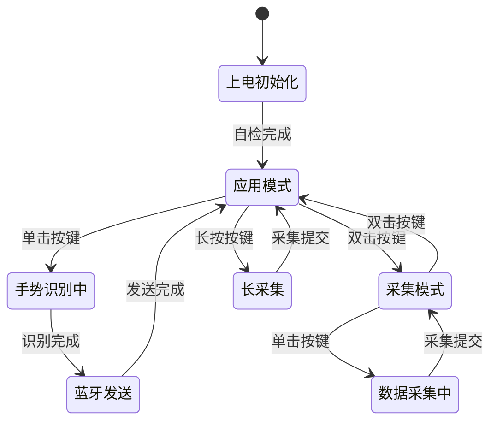

# 赛博魔杖项目需求文档（极简版）

> **最后更新**: 2026-04-17  
> **设计原则**: 只保留"手势识别 + 蓝牙数据发送 / 广播"核心功能  
> **基于电路**: `HardWare/schematic/skidl/cyberwand_circuit.py`（v3.0 极简版）

## 硬件配置概览

### 主要硬件
- **主控**: ESP32-S3-WROOM-1N16R8（16MB Flash + 8MB PSRAM，含 BLE 5.0）
- **传感器**: MPU6050 六轴运动传感器（加速度计 + 陀螺仪）
- **电源**: USB Type-C + TP4056 充电 + ME6211 稳压 + 603040 锂电池（800mAh）
- **保护**: USBLC6-2SC6 ESD + PTC 500mA 自恢复保险丝
- **交互**:
    - 1 颗系统状态 LED（由 GPIO 直驱，用于反馈系统与识别状态）
    - 2 颗电源状态 LED（红=充电中 / 绿=已充满，由 TP4056 直接驱动）
    - 1 个用户按键（通过单击 / 双击 / 长按组合实现多功能）
    - 1 个电源开关

### 已移除硬件（相比旧版本）
- ❌ HS20S010B TFT LCD（2.0 寸屏）
- ❌ MicroSD 卡座
- ❌ DFPlayer Mini + 扬声器（音频输出）
- ❌ INMP441 I2S 麦克风（音频输入）
- ❌ WS2812B 可编程 RGB LED 带 + SN74AHCT125 电平转换
- ❌ 多按键（从"模式/选择/播放"三键改为单键多功能）

## 用户需求

### 需求 1: 开机与基础运行
**As a** user  
**I want to** 打开电源开关后魔杖自动进入工作状态  
**So that** 我可以直接使用手势识别功能  

**Given** 电池有电且电源开关关闭  
**When** 我拨动电源开关到 ON 位置  
**Then** 系统完成自检并自动进入"应用模式"  
**And** 状态 LED 显示系统已就绪（常亮或缓慢呼吸）  
**And** 蓝牙自动开启并进入广播状态  

### 需求 2: 手势识别（应用模式，核心功能）
**As a** user  
**I want to** 在握持魔杖做出预设手势时系统自动识别  
**So that** 我可以用手势触发下游设备的响应  

**Given** 魔杖处于应用模式  
**When** 我按下用户按键（单击）并在规定时间窗口内完成一个手势动作  
**Then** MPU6050 采集完整运动数据序列  
**And** 内置 CNN 模型（nnom）基于四元组 / 加速度数据进行分类  
**And** 状态 LED 短闪一次表示识别完成  
**And** 识别出的手势 ID 通过蓝牙发送（见需求 3）  

### 需求 3: 蓝牙数据发送与广播
**As a** user  
**I want to** 把识别出的手势以蓝牙数据的形式送出  
**So that** 任意蓝牙客户端（手机 / PC / 其他设备）都能接收并响应  

**Given** 手势识别已完成并得到一个手势 ID  
**When** 系统开始发送阶段  
**Then** 如果已有客户端通过 GATT 连接：
  - 通过预定义的 NOTIFY 特征（UUID `6E400003-B5A3-F393-E0A9-E50E24DCCA9E`）把手势对应的字符串发送给客户端  
**And** 如果没有客户端连接：
  - 更新 BLE 广播数据中的 Manufacturer Data 字段，把手势对应的字符串放入广播包  
  - 周围任意扫描者都可以从广播包解析到手势信息  
**And** 每个手势 ID 对应一串可配置的有效载荷字符串（固件内默认表，后续可写入 NVS）  

### 需求 4: 手势数据采集（采集模式，为训练模型准备数据）
**As a** developer  
**I want to** 把魔杖切换到"采集模式"来录制自定义手势的原始数据  
**So that** 我可以导出数据用于训练新的手势识别模型  

**Given** 魔杖处于应用模式  
**When** 我双击用户按键  
**Then** 系统切换到采集模式  
**And** 状态 LED 以较快频率闪烁以提示"采集中"  
**When** 我在采集模式下按下用户按键  
**Then** 系统采集一段 IMU 数据并通过 USB 串口输出 / 或写入内部 Flash  
**And** 完成一次采集后 LED 恢复采集模式提示  
**When** 我再次双击用户按键  
**Then** 系统退回应用模式  

### 需求 5: 长按采集（便于快速记录一段长数据）
**As a** developer  
**I want to** 通过长按按键记录一段较长的 IMU 数据  
**So that** 我可以在模型验证时方便地采一段完整序列  

**Given** 魔杖已开机  
**When** 我长按用户按键  
**Then** 系统采集一段预设长度的 IMU 数据并 Commit  

### 需求 6: 充电与电源管理
**As a** user  
**I want to** 通过 USB Type-C 给魔杖充电  
**So that** 我不需要频繁更换电池  

**Given** 魔杖插入 Type-C 充电线  
**When** 充电开始  
**Then** 红色充电指示 LED 亮起（由 TP4056 CHRG 驱动）  
**When** 电池充满  
**Then** 红色 LED 熄灭，绿色充满 LED 亮起（由 TP4056 STDBY 驱动）  
**And** 即使在关机状态下充电过程依然有效  

### 需求 7: 蓝牙配置（可选，后期扩展）
**As a** user  
**I want to** 通过上位机（`host_program/cyberwand_gui`）修改每个手势对应的蓝牙字符串  
**So that** 我可以自定义不同手势触发下游设备的动作  

**Given** 魔杖与 PC 建立 BLE 连接  
**When** 上位机通过特定 GATT 特征写入一组映射（手势 ID → 字符串）  
**Then** 固件把映射保存到 NVS  
**And** 下次上电后读取并覆盖默认表  

> 需求 7 为可选扩展，当前 MVP 固件使用固件内硬编码的默认映射。

## 不再支持的功能

以下功能在旧版本中存在，现在明确 **不再支持**：

- LCD 屏幕显示 / 菜单界面
- 手势录制图片指导
- DFPlayer 语音提示（"录制开始"/"录制完成"等）
- MicroSD 卡本地文件存储
- INMP441 语音检测 / 语音命令
- WiFi 热点 / 产测模式 / PC 端实时数据上传
- WS2812B 法术卡灯效
- 多按键菜单导航

## 交互状态概览

## 接口协议摘要

### BLE GATT 服务
| 项目 | 值 |
|---|---|
| 设备名 | `CyberWand` |
| 主服务 UUID | `6E400001-B5A3-F393-E0A9-E50E24DCCA9E` |
| TX 特征 UUID（NOTIFY/READ）| `6E400003-B5A3-F393-E0A9-E50E24DCCA9E` |

### BLE 广播
未连接时，把手势有效载荷放入 Manufacturer Data 字段，外部扫描者可直接从广播包读取。

### 默认手势映射（固件示例）
| 手势 ID | 广播字符串 |
|---|---|
| 0 | `GESTURE_CIRCLE` |
| 1 | `GESTURE_LIGHTNING` |
| 2 | `GESTURE_H` |
| 3 | `GESTURE_W` |
